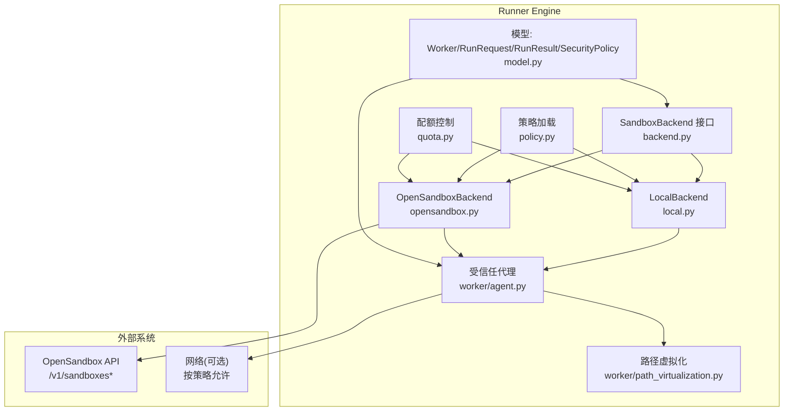
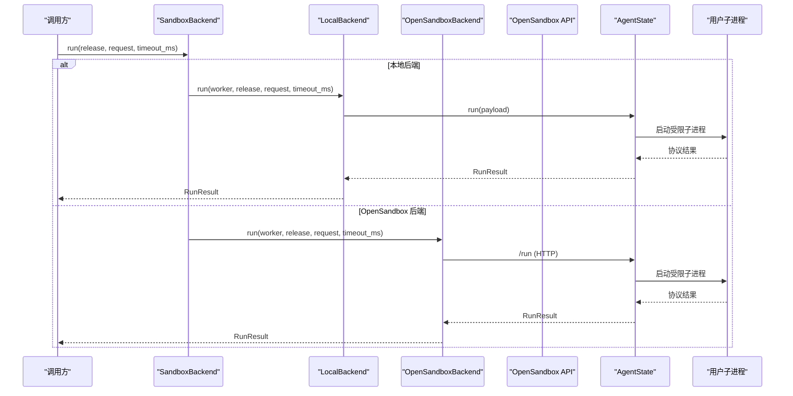
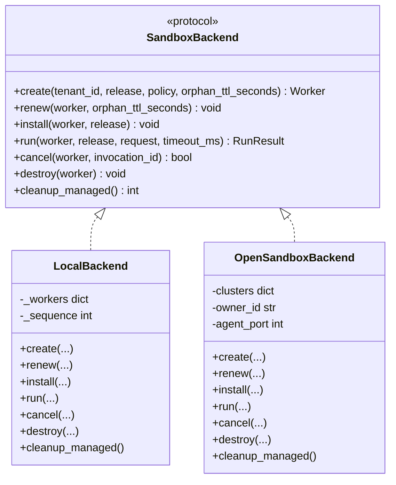
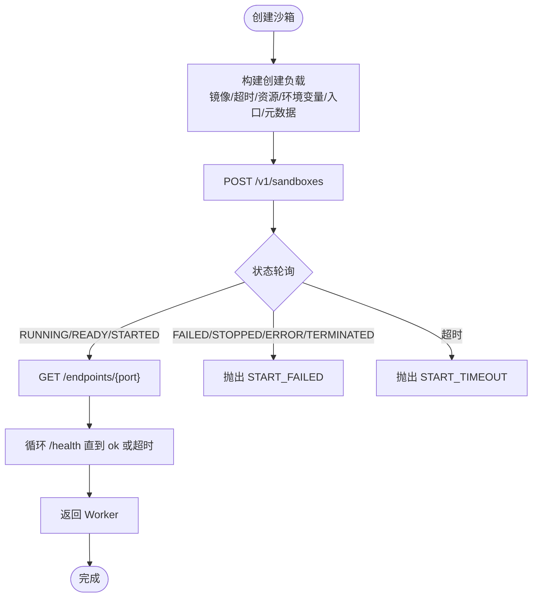
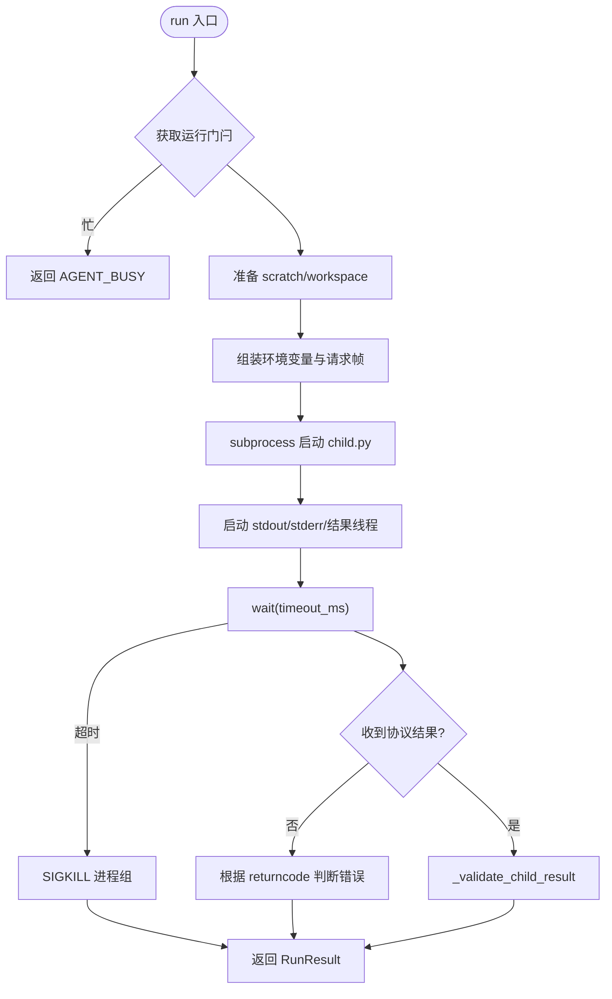
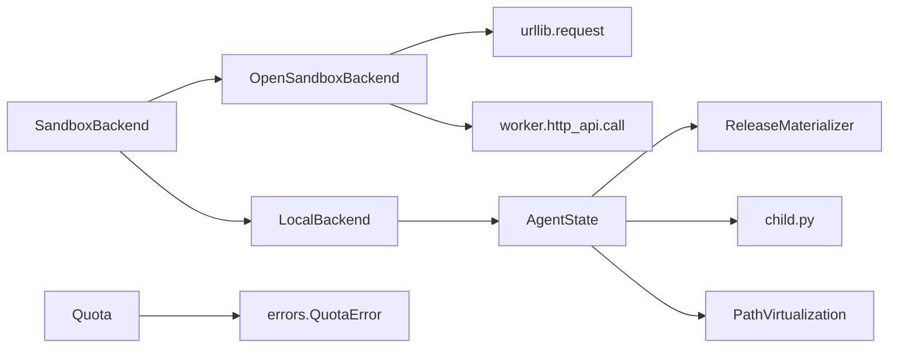

# 环境隔离

<cite>
**本文引用的文件**   
- [runner_engine/sandbox/backend.py](file://runner_engine/sandbox/backend.py)
- [runner_engine/sandbox/local.py](file://runner_engine/sandbox/local.py)
- [runner_engine/sandbox/opensandbox.py](file://runner_engine/sandbox/opensandbox.py)
- [runner_engine/model.py](file://runner_engine/model.py)
- [runner_engine/policy.py](file://runner_engine/policy.py)
- [config/policies.json](file://config/policies.json)
- [config/opensandbox.example.json](file://config/opensandbox.example.json)
- [config/opensandbox.json](file://config/opensandbox.json)
- [infra/opensandbox/README.md](file://infra/opensandbox/README.md)
- [runner_engine/worker/agent.py](file://runner_engine/worker/agent.py)
- [runner_engine/worker/path_virtualization.py](file://runner_engine/worker/path_virtualization.py)
- [runner_engine/quota.py](file://runner_engine/quota.py)
</cite>

## 目录
1. [引言](#引言)
2. [项目结构](#项目结构)
3. [核心组件](#核心组件)
4. [架构总览](#架构总览)
5. [详细组件分析](#详细组件分析)
6. [依赖关系分析](#依赖关系分析)
7. [性能与资源限制](#性能与资源限制)
8. [配置示例与最佳实践](#配置示例与最佳实践)
9. [监控、故障排查与恢复](#监控故障排查与恢复)
10. [结论](#结论)

## 引言
本文件围绕“环境隔离”能力，系统性说明基于沙箱的安全执行环境设计。重点包括：
- 进程隔离：通过受信任代理在受限用户下运行用户代码，限制进程树、文件描述符、日志输出和协议大小。
- 文件系统虚拟化：为 Python 层提供绝对路径重写与写隔离，避免直接修改宿主或容器真实路径。
- 网络隔离：默认拒绝出站网络，按策略允许有限域名；OpenSandbox 后端将安全运行时与 Worker 端点置于私有网络。
- 后端实现：本地开发测试后端与 OpenSandbox 生产后端。
- 生命周期管理：创建、续租、安装、运行、取消、销毁、托管清理。
- 配额控制：全局并发创建、在线沙箱数、租户维度在线沙箱上限。
- 配置与策略：安全策略选择隔离级别、CPU/内存、超时、网络白名单、是否复用沙箱。
- 监控与排障：健康检查、状态轮询、错误码分类、超时与资源超限处理。

## 项目结构
与环境隔离相关的关键目录与文件如下：
- runner_engine/sandbox：沙箱后端抽象与具体实现（本地、OpenSandbox）。
- runner_engine/worker：受信任代理、子进程执行、路径虚拟化。
- runner_engine/model：Worker、RunRequest、RunResult、SecurityPolicy 等核心数据模型。
- runner_engine/policy：加载安全策略配置。
- config：OpenSandbox 集群配置与安全策略。
- infra/opensandbox：OpenSandbox 部署说明。
- runner_engine/quota：沙箱配额控制。

**图表来源**
- [runner_engine/sandbox/backend.py:14-49](file://runner_engine/sandbox/backend.py#L14-L49)
- [runner_engine/sandbox/local.py:14-132](file://runner_engine/sandbox/local.py#L14-L132)
- [runner_engine/sandbox/opensandbox.py:31-440](file://runner_engine/sandbox/opensandbox.py#L31-L440)
- [runner_engine/model.py:26-98](file://runner_engine/model.py#L26-L98)
- [runner_engine/policy.py:9-25](file://runner_engine/policy.py#L9-L25)
- [runner_engine/quota.py:9-61](file://runner_engine/quota.py#L9-L61)
- [runner_engine/worker/agent.py:309-798](file://runner_engine/worker/agent.py#L309-L798)
- [runner_engine/worker/path_virtualization.py:62-739](file://runner_engine/worker/path_virtualization.py#L62-L739)

**章节来源**
- [runner_engine/sandbox/backend.py:14-49](file://runner_engine/sandbox/backend.py#L14-L49)
- [runner_engine/sandbox/local.py:14-132](file://runner_engine/sandbox/local.py#L14-L132)
- [runner_engine/sandbox/opensandbox.py:31-440](file://runner_engine/sandbox/opensandbox.py#L31-L440)
- [runner_engine/model.py:26-98](file://runner_engine/model.py#L26-L98)
- [runner_engine/policy.py:9-25](file://runner_engine/policy.py#L9-L25)
- [runner_engine/quota.py:9-61](file://runner_engine/quota.py#L9-L61)
- [runner_engine/worker/agent.py:309-798](file://runner_engine/worker/agent.py#L309-L798)
- [runner_engine/worker/path_virtualization.py:62-739](file://runner_engine/worker/path_virtualization.py#L62-L739)

## 核心组件
- SandboxBackend 接口：定义 create/renew/install/run/cancel/destroy/cleanup_managed 统一能力，屏蔽后端差异。
- LocalBackend：面向开发与测试的本地后端，非安全沙箱，使用临时目录与本地 AgentState。
- OpenSandboxBackend：面向生产的远程沙箱后端，调用 OpenSandbox API 创建、等待就绪、获取端点、与 Worker 通信。
- Worker：表示一个沙箱工作单元，包含标识、端点、令牌、租户、运行时、策略标签、过期时间、元数据等。
- SecurityPolicy：决定隔离级别、CPU/内存、最大超时、网络白名单、是否复用沙箱。
- AgentState：受信任代理，负责安装发布包、单实例串行执行用户代码、限制输出与协议大小、清理进程组与用户进程。
- PathVirtualization：Python 级文件系统虚拟化层，重定向绝对路径读写到 invocation 专属目录。
- Quota：控制全局与租户维度的在线沙箱数量及并发创建速率。

**章节来源**
- [runner_engine/sandbox/backend.py:14-49](file://runner_engine/sandbox/backend.py#L14-L49)
- [runner_engine/sandbox/local.py:14-132](file://runner_engine/sandbox/local.py#L14-L132)
- [runner_engine/sandbox/opensandbox.py:31-440](file://runner_engine/sandbox/opensandbox.py#L31-L440)
- [runner_engine/model.py:26-98](file://runner_engine/model.py#L26-L98)
- [runner_engine/worker/agent.py:309-798](file://runner_engine/worker/agent.py#L309-L798)
- [runner_engine/worker/path_virtualization.py:62-739](file://runner_engine/worker/path_virtualization.py#L62-L739)
- [runner_engine/quota.py:9-61](file://runner_engine/quota.py#L9-L61)

## 架构总览
下图展示一次典型运行的端到端流程：上层调度根据策略选择后端，创建或复用沙箱，安装发布包，向 Worker 发起运行请求，Worker 启动受限子进程执行用户代码，最终返回结果。

**图表来源**
- [runner_engine/sandbox/local.py:78-111](file://runner_engine/sandbox/local.py#L78-L111)
- [runner_engine/sandbox/opensandbox.py:339-376](file://runner_engine/sandbox/opensandbox.py#L339-L376)
- [runner_engine/worker/agent.py:467-798](file://runner_engine/worker/agent.py#L467-L798)

## 详细组件分析

### 沙箱后端抽象与实现
- SandboxBackend 定义了统一的沙箱操作契约，包括创建、续租、安装、运行、取消、销毁与托管清理。
- LocalBackend 用于开发测试，不保证安全隔离；它维护本地 AgentState 与临时目录，并在 destroy/cleanup_managed 中清理资源。
- OpenSandboxBackend 通过 HTTP 调用 OpenSandbox API，完成沙箱创建、状态轮询、端点获取、健康检查、安装、运行、取消、销毁与批量清理。

**图表来源**
- [runner_engine/sandbox/backend.py:14-49](file://runner_engine/sandbox/backend.py#L14-L49)
- [runner_engine/sandbox/local.py:14-132](file://runner_engine/sandbox/local.py#L14-L132)
- [runner_engine/sandbox/opensandbox.py:31-440](file://runner_engine/sandbox/opensandbox.py#L31-L440)

**章节来源**
- [runner_engine/sandbox/backend.py:14-49](file://runner_engine/sandbox/backend.py#L14-L49)
- [runner_engine/sandbox/local.py:14-132](file://runner_engine/sandbox/local.py#L14-L132)
- [runner_engine/sandbox/opensandbox.py:31-440](file://runner_engine/sandbox/opensandbox.py#L31-L440)

### 本地沙箱后端（LocalBackend）
- 创建 Worker：生成唯一 ID、随机令牌、临时目录，设置 AgentState 的运行根目录、依赖根目录、子进程 UID/GID、nproc/nofile 等参数。
- 安装发布包：将 artifact 以 base64 形式注入 AgentState.bootstrap。
- 运行：封装 RunRequest 并调用 AgentState.run，将响应转换为 RunResult。
- 取消/销毁：调用 AgentState.cancel 或直接清理临时目录。
- 注意：该后端明确声明不是安全沙箱，仅适用于开发测试。

**章节来源**
- [runner_engine/sandbox/local.py:14-132](file://runner_engine/sandbox/local.py#L14-L132)

### OpenSandbox 后端（OpenSandboxBackend）
- 集群配置：从 clusters 字典读取 url/api_key，支持多集群（如 gvisor/kata）。
- 创建流程：
  - 构造 payload：镜像、超时、资源限制（cpu/memory）、环境变量、入口命令、元数据（managed-by、runner-owner、tenant、runtime、profile）。
  - 调用 /v1/sandboxes 创建，轮询状态直到 RUNNING/READY/STARTED，失败则抛出可重试错误。
  - 获取端点 /endpoints/{port}，必要时补全 http:// 前缀。
  - 健康检查：循环调用 /health，直至 ok 或超时。
  - 异常时尝试删除已创建的沙箱。
- 续租：调用 /renew-expiration 延长过期时间。
- 安装：调用 Worker /bootstrap 注入发布包。
- 运行：调用 Worker /run，附加传输宽限时间。
- 取消：调用 Worker /cancel。
- 销毁：调用 /v1/sandboxes/{id}，忽略 404。
- 托管清理：遍历所有集群，筛选 managed-by 与 runner-owner 匹配的沙箱并删除。

**图表来源**
- [runner_engine/sandbox/opensandbox.py:141-302](file://runner_engine/sandbox/opensandbox.py#L141-L302)

**章节来源**
- [runner_engine/sandbox/opensandbox.py:31-440](file://runner_engine/sandbox/opensandbox.py#L31-L440)

### 受信任代理与进程隔离（AgentState）
- 单实例串行：通过 _run_gate 确保同一 AgentState 内同时只有一个用户调用在执行。
- 子进程隔离：
  - 使用 subprocess.Popen 启动 child.py，独立会话，关闭无关 FD，传递请求/结果管道。
  - 限制 stdout/stderr 大小，超过阈值触发 SIGKILL 进程组。
  - 限制协议帧大小与属性大小，校验协议版本、类型、字段类型与长度。
  - 超时后强制终止进程组，并二次 kill 残留进程。
  - 清理用户进程：扫描 /proc 杀死指定 UID 的残留进程。
- 工作空间：
  - 每个 invocation 创建 scratch_dir，包含 home/tmp/cache/absolute 子目录。
  - 复制 runtime 目录到 workspace，并调整权限。
- 环境变量：
  - 设置 HOME/TMPDIR/XDG_CACHE_HOME/RUNNER_* 等变量，传递最大输出、属性、UID/GID、nproc/nofile、CPU 秒、地址空间限制等。
- 取消：标记 cancel_requested 并发送 SIGKILL 进程组。

**图表来源**
- [runner_engine/worker/agent.py:467-798](file://runner_engine/worker/agent.py#L467-L798)

**章节来源**
- [runner_engine/worker/agent.py:309-798](file://runner_engine/worker/agent.py#L309-L798)

### 文件系统虚拟化（PathVirtualization）
- 目标：在不改变容器真实文件系统的前提下，对 Python 层的绝对路径读写进行虚拟化。
- 行为：
  - 相对路径保持正常 cwd 语义。
  - 绝对写入重定向到 <invocation_root>/absolute/<原绝对路径>。
  - 绝对读取优先使用 invocation-local 覆盖文件，否则回退到真实容器路径。
  - 支持 open/io_open/os_open/mkdir/unlink/remove/rmdir/rename/replace/stat/lstat/access/listdir/scandir/readlink/symlink/link/chmod/utime/truncate/chdir/getcwd/getcwdb 等常见 API。
  - 禁止虚拟绝对路径穿越符号链接父目录，防止逃逸。
  - 通过“墓碑”机制模拟删除，使删除后的路径不可见。
- 安装/卸载：动态替换 builtins.open、io.open 与 os.* 函数，支持卸载恢复。
- 重要提示：这不是操作系统级沙箱；绕过 Python 文件系统 API 的原生代码仍能看到真实容器文件系统，但受限于非特权子进程 UID/GID。

**章节来源**
- [runner_engine/worker/path_virtualization.py:62-739](file://runner_engine/worker/path_virtualization.py#L62-L739)

### 安全策略与隔离级别
- SecurityPolicy 字段：
  - name：策略名称。
  - sandbox_cluster：选择 OpenSandbox 集群（如 gvisor/kata）。
  - cpu/memory：资源限制。
  - max_timeout_ms：最大允许超时。
  - network_allow：允许的网络域名列表（默认空表示拒绝）。
  - reuse_sandbox：是否复用沙箱。
- policy.py 加载策略 JSON，映射为 SecurityPolicy 对象。
- policies.json 示例：
  - standard：gvisor 集群，1 CPU，512Mi 内存，60s 超时，无网络白名单，可复用。
  - hardened：kata 集群，2 CPU，1Gi 内存，30s 超时，无网络白名单，不复用。

**章节来源**
- [runner_engine/model.py:26-35](file://runner_engine/model.py#L26-L35)
- [runner_engine/policy.py:9-25](file://runner_engine/policy.py#L9-L25)
- [config/policies.json:1-19](file://config/policies.json#L1-L19)

### 配额控制（Quota）
- 全局并发创建：通过 BoundedSemaphore 限制同时创建中的沙箱数量。
- 在线沙箱上限：全局与租户维度分别限制。
- 预留与释放：reserve_live/release_live 原子更新计数，超出配额抛出 QuotaError（可重试）。
- live 属性：当前在线沙箱总数。

**章节来源**
- [runner_engine/quota.py:9-61](file://runner_engine/quota.py#L9-L61)

## 依赖关系分析
- SandboxBackend 作为抽象，被上层调度器依赖；LocalBackend 与 OpenSandboxBackend 实现其接口。
- OpenSandboxBackend 依赖 urllib 访问 OpenSandbox API，并通过 worker.http_api.call 与 Worker 通信。
- AgentState 依赖 materializer 安装发布包，依赖 child.py 执行用户逻辑。
- PathVirtualization 依赖 Python 标准库并重写文件系统 API。
- Quota 与 errors.QuotaError 配合，对外暴露配额违规信号。

**图表来源**
- [runner_engine/sandbox/backend.py:14-49](file://runner_engine/sandbox/backend.py#L14-L49)
- [runner_engine/sandbox/local.py:14-132](file://runner_engine/sandbox/local.py#L14-L132)
- [runner_engine/sandbox/opensandbox.py:31-440](file://runner_engine/sandbox/opensandbox.py#L31-L440)
- [runner_engine/worker/agent.py:309-798](file://runner_engine/worker/agent.py#L309-L798)
- [runner_engine/worker/path_virtualization.py:62-739](file://runner_engine/worker/path_virtualization.py#L62-L739)
- [runner_engine/quota.py:9-61](file://runner_engine/quota.py#L9-L61)

**章节来源**
- [runner_engine/sandbox/backend.py:14-49](file://runner_engine/sandbox/backend.py#L14-L49)
- [runner_engine/sandbox/local.py:14-132](file://runner_engine/sandbox/local.py#L14-L132)
- [runner_engine/sandbox/opensandbox.py:31-440](file://runner_engine/sandbox/opensandbox.py#L31-L440)
- [runner_engine/worker/agent.py:309-798](file://runner_engine/worker/agent.py#L309-L798)
- [runner_engine/worker/path_virtualization.py:62-739](file://runner_engine/worker/path_virtualization.py#L62-L739)
- [runner_engine/quota.py:9-61](file://runner_engine/quota.py#L9-L61)

## 性能与资源限制
- 进程与 I/O 限制：
  - 子进程 stdout/stderr 各限制 1MB，超过即终止进程组并返回 LOG_LIMIT。
  - 协议帧与属性大小受严格校验，超限返回 CHILD_PROTOCOL_ERROR。
  - 子进程 CPU 时间通过环境变量 RUNNER_CHILD_CPU_SECONDS 估算，结合超时计算。
  - 子进程 nproc/nofile 由 AgentState 初始化参数控制。
- 网络限制：
  - 默认 deny-by-default，network_allow 为空表示不允许出站。
  - OpenSandbox 部署建议将控制面与 Worker 端点置于私有网络。
- 资源配额：
  - 全局与租户维度的在线沙箱上限，避免资源耗尽。
  - 并发创建速率限制，保护后端稳定性。
- 超时与重试：
  - OpenSandbox 创建与健康检查具有固定等待时限，失败标记为可重试。
  - 运行超时由上层传入 timeout_ms，并增加传输宽限时间。

[本节为通用性能讨论，未直接分析具体文件]

## 配置示例与最佳实践

### OpenSandbox 集群配置
- opensandbox.example.json 与 opensandbox.json 展示了集群 URL 与 API Key 的配置方式。
- 建议：
  - 为不同隔离级别部署独立的 OpenSandbox 集群（例如 gvisor/kata）。
  - 使用强随机 API Key，并仅在私有网络暴露服务。
  - 将 runner 与 OpenSandbox 控制面、Worker 端点放在同一私有网络。

**章节来源**
- [config/opensandbox.example.json:1-11](file://config/opensandbox.example.json#L1-L11)
- [config/opensandbox.json:1-11](file://config/opensandbox.json#L1-L11)
- [infra/opensandbox/README.md:1-27](file://infra/opensandbox/README.md#L1-L27)

### 安全策略配置
- policies.json 定义了 standard 与 hardened 两种策略：
  - standard：gvisor 集群，较低资源，允许复用沙箱。
  - hardened：kata 集群，更高资源，禁用复用，更短超时。
- 建议：
  - 高敏感任务使用 hardened 策略，禁用复用以降低跨任务污染风险。
  - 合理设置 max_timeout_ms，避免长尾任务占用资源。
  - 谨慎配置 network_allow，最小化允许域名集合。

**章节来源**
- [config/policies.json:1-19](file://config/policies.json#L1-L19)
- [runner_engine/policy.py:9-25](file://runner_engine/policy.py#L9-L25)

### 隔离级别选择策略
- 根据业务敏感度与性能需求选择：
  - 低风险、高吞吐：standard（gvisor），复用沙箱提升效率。
  - 高风险、强隔离：hardened（kata），不复用沙箱，缩短超时。
- 结合配额控制，避免全局与租户维度资源争抢。

**章节来源**
- [config/policies.json:1-19](file://config/policies.json#L1-L19)
- [runner_engine/quota.py:9-61](file://runner_engine/quota.py#L9-L61)

## 监控、故障排查与恢复

### 监控要点
- 健康检查：OpenSandbox 后端在创建后循环调用 /health，确认 Worker 就绪。
- 状态轮询：创建沙箱后轮询状态，识别 RUNNING/READY/STARTED 或 FAILED/STOPPED/ERROR/TERMINATED。
- 在线沙箱数：Quota.live 提供当前在线沙箱总数。
- 错误码：
  - OPENSANDBOX_HTTP/OPENSANDBOX_UNREACHABLE：OpenSandbox API 错误或不可达。
  - SANDBOX_START_FAILED/SANDBOX_START_TIMEOUT：沙箱启动失败或超时。
  - AGENT_START_TIMEOUT：可信代理未就绪。
  - AGENT_BUSY：代理正忙，已有活跃调用。
  - TIMEOUT/CANCELLED/LOG_LIMIT/CHILD_PROTOCOL_ERROR：子进程执行异常。

**章节来源**
- [runner_engine/sandbox/opensandbox.py:141-302](file://runner_engine/sandbox/opensandbox.py#L141-L302)
- [runner_engine/worker/agent.py:467-798](file://runner_engine/worker/agent.py#L467-L798)

### 故障排查指南
- 无法连接 OpenSandbox：
  - 检查集群 URL 与 API Key 是否正确。
  - 确认网络连通性与防火墙策略。
  - 查看 OPENSANDBOX_HTTP/OPENSANDBOX_UNREACHABLE 错误详情。
- 沙箱启动失败：
  - 检查镜像是否存在、入口命令是否正确。
  - 关注 SANDBOX_START_FAILED/SANDBOX_START_TIMEOUT。
- 代理未就绪：
  - 检查 Worker 端口与端点头信息。
  - 关注 AGENT_START_TIMEOUT。
- 子进程超时或崩溃：
  - 检查 TIMEOUT/CPU_LIMIT/USER_PROCESS_SIGNALED。
  - 查看 stderr_tail 与日志溢出标志。
- 配额耗尽：
  - 检查全局与租户在线沙箱上限。
  - 关注 GLOBAL_SANDBOX_QUOTA/TENANT_SANDBOX_QUOTA。

**章节来源**
- [runner_engine/sandbox/opensandbox.py:61-110](file://runner_engine/sandbox/opensandbox.py#L61-L110)
- [runner_engine/sandbox/opensandbox.py:141-302](file://runner_engine/sandbox/opensandbox.py#L141-L302)
- [runner_engine/worker/agent.py:467-798](file://runner_engine/worker/agent.py#L467-L798)
- [runner_engine/quota.py:36-44](file://runner_engine/quota.py#L36-L44)

### 恢复与自愈
- 可重试错误：OpenSandbox 后端将部分错误标记为 retryable，上层可自动重试。
- 托管清理：OpenSandboxBackend.cleanup_managed 会删除带有 managed-by 与 runner-owner 标签的沙箱，避免孤儿资源。
- 本地清理：LocalBackend.cleanup_managed 清理本地临时目录。

**章节来源**
- [runner_engine/sandbox/opensandbox.py:401-439](file://runner_engine/sandbox/opensandbox.py#L401-L439)
- [runner_engine/sandbox/local.py:124-131](file://runner_engine/sandbox/local.py#L124-L131)

## 结论
本仓库的环境隔离方案通过“受信任代理 + 进程隔离 + 文件系统虚拟化 + 网络白名单 + 配额控制”的组合，提供了从开发测试到生产部署的多层次安全保障。LocalBackend 便于快速验证，OpenSandboxBackend 对接生产级隔离运行时。安全策略与配额机制共同约束资源使用，错误分类与重试策略提升鲁棒性。建议在高风险场景采用 hardened 策略与 kata 集群，严格控制网络与资源，并结合监控与自动化清理保障系统稳定。

[本节为总结性内容，未直接分析具体文件]