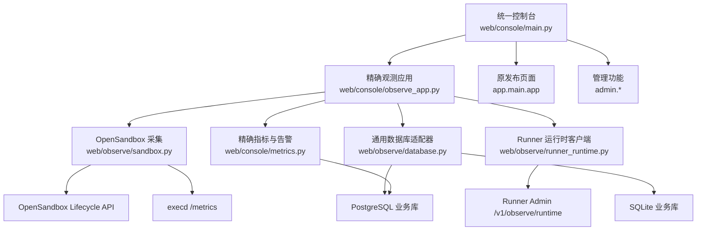
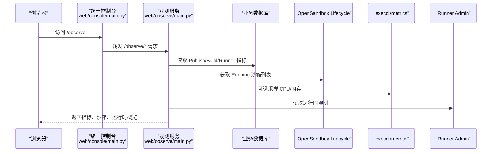
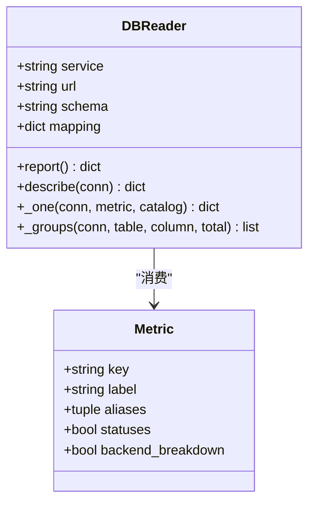
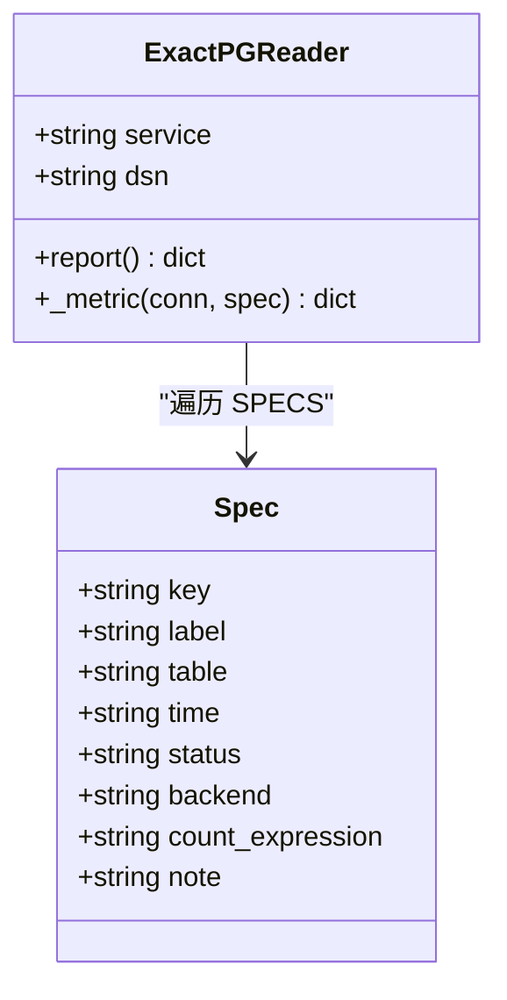
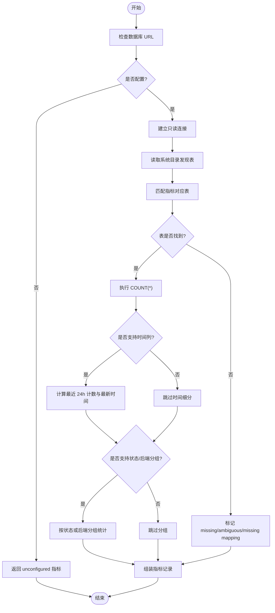
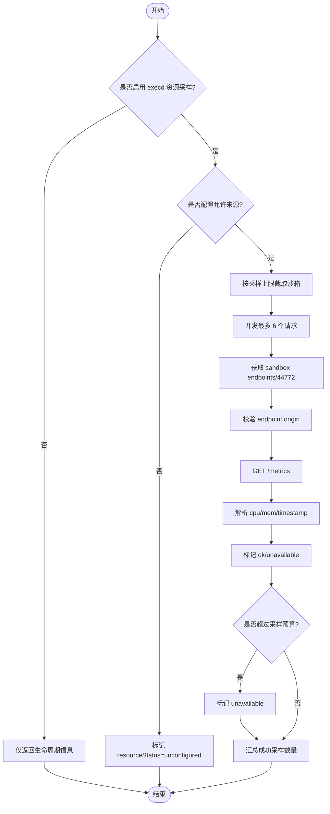
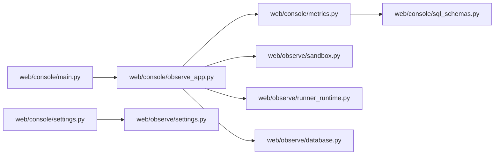

# 监控观察

<cite>
**本文引用的文件**   
- [OBSERVABILITY_README.md](file://web/OBSERVABILITY_README.md)
- [RUNTIME_DIAGNOSIS.md](file://web/RUNTIME_DIAGNOSIS.md)
- [main.py](file://web/console/main.py)
- [observe_app.py](file://web/console/observe_app.py)
- [settings.py](file://web/console/settings.py)
- [sql_schemas.py](file://web/console/sql_schemas.py)
- [metrics.py](file://web/console/metrics.py)
- [main.py](file://web/observe/main.py)
- [database.py](file://web/observe/database.py)
- [sandbox.py](file://web/observe/sandbox.py)
- [runner_runtime.py](file://web/observe/runner_runtime.py)
- [runtime_routes.py](file://web/observe/runtime_routes.py)
</cite>

## 目录
1. [引言](#引言)
2. [项目结构](#项目结构)
3. [核心组件](#核心组件)
4. [架构总览](#架构总览)
5. [详细组件分析](#详细组件分析)
6. [依赖关系分析](#依赖关系分析)
7. [性能与可观测性特征](#性能与可观测性特征)
8. [告警规则与指标规范](#告警规则与指标规范)
9. [自定义指标采集与面板配置指南](#自定义指标采集与面板配置指南)
10. [分布式追踪、日志关联与瓶颈定位](#分布式追踪日志关联与瓶颈定位)
11. [故障诊断指南](#故障诊断指南)
12. [结论](#结论)

## 引言
本仓库的“监控观察”能力由两套可独立部署、也可统一入口聚合的前端与只读 API 组成：
- 独立观测服务 `web/observe`：面向生产环境的只读观测控制台，提供数据库快照指标、OpenSandbox 生命周期与可选 execd 资源采样。
- 统一控制台 `web/console`：将原发布页面、精确 PostgreSQL 观测模块和管理功能聚合到同一 ASGI 进程，并通过 `/observe`、`/admin`、`/console` 等路径路由。

该设计强调“只读、最小权限、不伪造数据”，所有指标都来自真实数据库或外部系统；未连接或未识别时明确显示空状态，而不是生成示例值。

**章节来源**
- [OBSERVABILITY_README.md:1-54](file://web/OBSERVABILITY_README.md#L1-L54)
- [main.py:1-10](file://web/console/main.py#L1-L10)

## 项目结构
从监控观察角度，关键目录和职责如下：

| 路径 | 职责 | 说明 |
|---|---|---|
| `web/observe/main.py` | 独立 FastAPI 应用入口 | 提供健康检查、数据库、沙箱、Runner 运行时概览接口 |
| `web/observe/database.py` | 通用只读数据库适配器 | 支持 SQLite 与 PostgreSQL，基于系统目录自动发现表并计算聚合指标 |
| `web/observe/sandbox.py` | OpenSandbox 生命周期与 execd 指标采集 | 分页读取 Running 沙箱，可选并发采样 CPU/内存 |
| `web/observe/runner_runtime.py` | Runner 运行时观测客户端 | 调用 Runner Admin 的 `/v1/observe/runtime` |
| `web/console/main.py` | 统一控制台入口 | 路由分发到发布、观测、管理三个子应用 |
| `web/console/observe_app.py` | 精确 PostgreSQL 观测层 | 使用硬编码 DDL 表名与列名，避免动态 SQL |
| `web/console/metrics.py` | 精确指标与告警规则定义 | 为 Publish/Build/Runner 定义指标规格与 CHECK 告警 |
| `web/console/sql_schemas.py` | PostgreSQL schema 标识校验与路由 | 仅允许简单标识符，防止注入 |
| `web/console/settings.py` | 统一环境变量配置 | 聚合观测、管理、跨域与安全相关设置 |

**图表来源**
- [main.py:34-115](file://web/console/main.py#L34-L115)
- [observe_app.py:25-109](file://web/console/observe_app.py#L25-L109)
- [metrics.py:17-55](file://web/console/metrics.py#L17-L55)
- [database.py:98-155](file://web/observe/database.py#L98-L155)
- [sandbox.py:87-109](file://web/observe/sandbox.py#L87-L109)
- [runner_runtime.py:9-24](file://web/observe/runner_runtime.py#L9-L24)

**章节来源**
- [main.py:34-115](file://web/console/main.py#L34-L115)
- [observe_app.py:25-109](file://web/console/observe_app.py#L25-L109)
- [database.py:1-10](file://web/observe/database.py#L1-L10)

## 核心组件
### 独立观测服务
独立观测服务通过 `python -m observe.main --host 127.0.0.1 --port 9195` 启动，暴露以下主要接口：
- `/observe/health`：服务健康检查
- `/observe/api/databases`：按服务维度返回数据库指标报告
- `/observe/api/sandboxes`：OpenSandbox 运行实例列表与资源采样摘要
- `/observe/api/runner-runtime`：Runner 运行时观测信息
- `/observe/api/overview`：聚合上述三项的概览

鉴权方面，若配置了 `OBS_BASIC_USER` 与 `OBS_BASIC_PASSWORD`，则启用 HTTP Basic 认证，并在响应头中设置安全策略，如禁止缓存、禁止嵌套框架、限制内容源等。

**章节来源**
- [main.py:28-54](file://web/observe/main.py#L28-L54)
- [main.py:57-168](file://web/observe/main.py#L57-L168)
- [main.py:174-193](file://web/observe/main.py#L174-L193)

### 统一控制台
统一控制台将三条路径分别交给不同子应用：
- `/observe/*`：进入观测模块
- `/admin/*`：进入管理模块
- `/console/*`：控制台首页与静态资源
- 其他路径：回退到原发布页面

它不会修改原发布页面的路由，也不会导入其业务逻辑，从而保证观测与管理扩展不影响发布功能。

**章节来源**
- [main.py:1-10](file://web/console/main.py#L1-L10)
- [main.py:34-115](file://web/console/main.py#L34-L115)

### 精确 PostgreSQL 观测层
精确观测层使用硬编码的 DDL 表名与列名，不再依赖浏览器或配置文件中的动态 SQL。它负责：
- 定义 Publish、Build、Runner 三类服务的指标规格
- 定义风险类 CHECK 告警规则
- 以只读事务和语句超时访问 PostgreSQL
- 输出指标质量、最近 24h 计数、状态分布、后端分布及错误提示

**章节来源**
- [observe_app.py:1-21](file://web/console/observe_app.py#L1-L21)
- [metrics.py:1-5](file://web/console/metrics.py#L1-L5)
- [metrics.py:17-55](file://web/console/metrics.py#L17-L55)
- [metrics.py:149-169](file://web/console/metrics.py#L149-L169)

### 通用数据库适配器
通用适配器用于 `web/observe` 的 SQLite/PostgreSQL 多方言聚合：
- 通过系统目录（SQLite `sqlite_master`、PostgreSQL `information_schema`）发现表
- 根据别名匹配真实表名
- 自动识别时间列、状态列、后端分组列
- 计算总数、最近 24h 计数、状态分布、后端分布
- 对连接、查询失败进行归一化错误处理，不泄露密码或 SQL

**章节来源**
- [database.py:1-5](file://web/observe/database.py#L1-L5)
- [database.py:22-70](file://web/observe/database.py#L22-L70)
- [database.py:98-155](file://web/observe/database.py#L98-L155)
- [database.py:226-302](file://web/observe/database.py#L226-L302)
- [database.py:336-390](file://web/observe/database.py#L336-L390)

### OpenSandbox 生命周期与资源采样
`SandboxReader` 只做 GET 请求，不创建、停止或执行沙箱：
- 分页获取 Running 沙箱
- 展示存活时长、TTL、镜像、快照 ID
- 可选开启 execd 资源采样，并发上限 6，默认最多采样 30 个实例，整体采样预算约 18 秒
- 严格校验 endpoint origin、header 白名单、URL 格式，禁止任意重定向

**章节来源**
- [sandbox.py:1-6](file://web/observe/sandbox.py#L1-L6)
- [sandbox.py:87-109](file://web/observe/sandbox.py#L87-L109)
- [sandbox.py:137-196](file://web/observe/sandbox.py#L137-L196)
- [sandbox.py:198-325](file://web/observe/sandbox.py#L198-L325)

### Runner 运行时观测客户端
`RunnerRuntimeReader` 通过环境变量配置 Runner Admin 地址与 token，调用 `/v1/observe/runtime`，返回结构化运行时观测数据。未配置时返回 `unconfigured`，HTTP 错误时返回带状态码的错误消息。

**章节来源**
- [runner_runtime.py:9-24](file://web/observe/runner_runtime.py#L9-L24)
- [runner_runtime.py:26-63](file://web/observe/runner_runtime.py#L26-L63)
- [runtime_routes.py:10-19](file://web/observe/runtime_routes.py#L10-L19)

## 架构总览
下图展示了用户浏览器、统一控制台、独立观测服务与下游系统的交互关系。

**图表来源**
- [main.py:91-112](file://web/console/main.py#L91-L112)
- [main.py:116-153](file://web/observe/main.py#L116-L153)
- [database.py:336-367](file://web/observe/database.py#L336-L367)
- [sandbox.py:198-307](file://web/observe/sandbox.py#L198-L307)
- [runner_runtime.py:26-63](file://web/observe/runner_runtime.py#L26-L63)

## 详细组件分析

### 指标数据模型
#### 通用指标模型
通用数据库适配器使用 `Metric` 数据结构描述一个指标：
- `key`：指标键
- `label`：人类可读标签
- `aliases`：候选表名集合
- `statuses`：是否支持状态细分
- `backend_breakdown`：是否支持后端分组细分

**图表来源**
- [database.py:22-30](file://web/observe/database.py#L22-L30)
- [database.py:98-155](file://web/observe/database.py#L98-L155)
- [database.py:318-334](file://web/observe/database.py#L318-L334)

#### 精确指标模型
精确 PostgreSQL 观测层使用 `Spec` 描述硬编码指标：
- `key`、`label`、`table`
- `time`：时间列
- `status`：状态列
- `backend`：后端分组列
- `count_expression`：计数表达式
- `note`：备注

**图表来源**
- [metrics.py:17-27](file://web/console/metrics.py#L17-L27)
- [metrics.py:149-169](file://web/console/metrics.py#L149-L169)
- [metrics.py:175-211](file://web/console/metrics.py#L175-L211)

#### 指标字段语义
两类实现输出的指标对象均包含：
- `key`、`label`、`table`
- `quality`：exact/unconfigured/error/ok 等质量标记
- `count`：总数
- `recent24h`：最近 24h 新增数
- `latestAt`：最新时间
- `byStatus`：状态分布
- `byBackend`：后端分布
- `note`：说明或错误原因

**章节来源**
- [database.py:226-302](file://web/observe/database.py#L226-L302)
- [metrics.py:175-211](file://web/console/metrics.py#L175-L211)

### 指标定义规范
#### 通用适配器支持的逻辑实体
通用适配器内置以下逻辑实体映射：
- Publish：Operators、Contract versions、Backend variants、Publish jobs
- Build：Runtime environments、Build jobs
- Runner：Registered releases、Executions、Runner jobs

这些逻辑实体通过多个常见表名别名尝试匹配，如果无法唯一匹配，需要配置 `OBS_TABLE_MAP_FILE`。

**章节来源**
- [database.py:31-66](file://web/observe/database.py#L31-L66)
- [OBSERVABILITY_README.md:86-144](file://web/OBSERVABILITY_README.md#L86-L144)

#### 精确 PostgreSQL 指标
精确观测层直接绑定以下物理表：
- Publish：`publish.operators`、`publish.virtual_contract_versions`、`publish.backend_variants`、`publish.publish_jobs`
- Build：`build.runtime_environments`、`build.runtime_env_aliases`、`build.build_jobs`
- Runner：`runner.leases`、`runner.runs`、`runner.idempotency_keys`

**章节来源**
- [metrics.py:29-55](file://web/console/metrics.py#L29-L55)
- [metrics.py:57-101](file://web/console/metrics.py#L57-L101)

### 数据处理流程
#### 数据库指标采集流程

**图表来源**
- [database.py:336-367](file://web/observe/database.py#L336-L367)
- [database.py:226-302](file://web/observe/database.py#L226-L302)
- [database.py:318-334](file://web/observe/database.py#L318-L334)

#### OpenSandbox 资源采样流程

**图表来源**
- [sandbox.py:198-307](file://web/observe/sandbox.py#L198-L307)
- [sandbox.py:137-196](file://web/observe/sandbox.py#L137-L196)
- [sandbox.py:55-84](file://web/observe/sandbox.py#L55-L84)

### 安全边界
- 无写接口，不执行 DELETE/POST 沙箱操作
- 数据库凭据仅在后端环境变量中使用，推荐 SELECT-only 账号
- Sandbox API Key 与 execd Endpoint Token 不返回浏览器
- execd endpoint origin 必须预配置，禁止通配符、路径、用户名密码、代理头
- 未配置或未连接时返回明确状态，不伪造监控数据
- 前端默认 20 秒刷新，可调整或关闭，无持久化历史

**章节来源**
- [OBSERVABILITY_README.md:237-248](file://web/OBSERVABILITY_README.md#L237-L248)
- [main.py:84-106](file://web/observe/main.py#L84-L106)
- [sandbox.py:21-29](file://web/observe/sandbox.py#L21-L29)
- [sandbox.py:55-84](file://web/observe/sandbox.py#L55-L84)

## 依赖关系分析

**图表来源**
- [main.py:21-29](file://web/console/main.py#L21-L29)
- [observe_app.py:16-20](file://web/console/observe_app.py#L16-L20)
- [metrics.py:12](file://web/console/metrics.py#L12)
- [sql_schemas.py:1-10](file://web/console/sql_schemas.py#L1-L10)
- [settings.py:8-13](file://web/console/settings.py#L8-L13)

**章节来源**
- [main.py:21-29](file://web/console/main.py#L21-L29)
- [observe_app.py:16-20](file://web/console/observe_app.py#L16-L20)
- [metrics.py:12](file://web/console/metrics.py#L12)
- [sql_schemas.py:1-10](file://web/console/sql_schemas.py#L1-L10)
- [settings.py:8-13](file://web/console/settings.py#L8-L13)

## 性能与可观测性特征
- 数据库连接采用只读事务与语句超时，避免长时间阻塞查询影响观测服务。
- 通用适配器对 SQLite 使用 `query_only=ON`，对 PostgreSQL 使用 `default_transaction_read_only=on`。
- OpenSandbox 资源采样使用信号量限制并发，并对整体采样设置超时，避免拖慢页面刷新。
- 指标输出包含质量标记与错误说明，便于区分“未配置”“查询失败”“部分采样失败”。
- 当前指标是“当前快照”，不是完整历史趋势；如需构建趋势面板，应结合外部指标存储或 OTLP/Prometheus。

**章节来源**
- [database.py:118-155](file://web/observe/database.py#L118-L155)
- [metrics.py:165-169](file://web/console/metrics.py#L165-L169)
- [sandbox.py:251-282](file://web/observe/sandbox.py#L251-L282)
- [OBSERVABILITY_README.md:138-144](file://web/OBSERVABILITY_README.md#L138-L144)

## 告警规则与指标规范
### 精确 PostgreSQL 告警规则
精确观测层定义了按服务分组的 CHECK 告警，包括：
- Publish：发布失败、长时间 RUNNING、已编译未发布、后端变体失败
- Build：缺少镜像的 READY 环境、构建失败、构建卡住、构建作业失败、superset 别名
- Runner：活跃租约、过期租约、长时间 RUNNING 运行、废弃运行、过期幂等键、被重放键

每条规则包含键、标签、严重级别、目标表和 WHERE 条件。

**章节来源**
- [metrics.py:103-146](file://web/console/metrics.py#L103-L146)

### 指标质量与状态
- `quality=exact`：指标可用
- `quality=error`：查询失败
- `quality=unconfigured`：未配置数据库或表映射
- `status=ok/error/unconfigured`：服务级可用性

**章节来源**
- [metrics.py:175-211](file://web/console/metrics.py#L175-L211)
- [database.py:336-367](file://web/observe/database.py#L336-L367)

## 自定义指标采集与面板配置指南
### 如何采集自定义指标
当前代码没有提供“在业务函数中埋点并写入 Prometheus”的 SDK。如果你需要在现有工程中采集自定义指标，建议遵循以下模式：
- 在业务服务中维护轻量计数器、直方图或仪表盘，例如发布成功率、构建耗时、Runner 执行延迟。
- 将这些指标暴露为内部 HTTP 接口或导出为 Prometheus 文本格式。
- 在观测侧新增专用 Reader，复用 `ExactPGReader` 或 `DBReader` 的设计思路：固定 SQL、只读连接、超时保护、错误归一化。
- 在前端新增面板时，优先复用现有 `/observe/api/overview` 聚合模式，避免每个指标单独轮询造成压力。

注意：不要直接让前端执行 SQL，也不要接受浏览器输入作为表名或列名。

**章节来源**
- [metrics.py:149-169](file://web/console/metrics.py#L149-L169)
- [database.py:98-155](file://web/observe/database.py#L98-L155)
- [main.py:141-153](file://web/observe/main.py#L141-L153)

### 如何配置监控面板
- 使用 `/observe/api/databases` 获取各服务指标，按 `key`、`label`、`count`、`recent24h`、`byStatus`、`byBackend` 渲染卡片。
- 使用 `/observe/api/sandboxes` 渲染沙箱列表，并根据 `resourceStatus` 显示资源采样状态。
- 使用 `/observe/api/runner-runtime` 渲染 Runner 运行时概览。
- 如果需要趋势面板，请接入外部时序数据库，并将当前快照作为“当前值”，历史趋势由外部系统提供。

**章节来源**
- [main.py:116-153](file://web/observe/main.py#L116-L153)
- [OBSERVABILITY_README.md:86-144](file://web/OBSERVABILITY_README.md#L86-L144)

### 如何设置告警阈值
- 对于精确 PostgreSQL 指标，可直接复用 `CHECKS` 中的规则，并结合外部告警系统（如 Prometheus Alertmanager、Grafana Alerts）对 `count > 0` 且 `severity=warning/high` 的规则触发告警。
- 对于 OpenSandbox 资源采样，可基于 `cpuPct`、`memUsedMiB`、`ttlSeconds` 设置阈值，但需注意这些数值来源于 execd 的系统指标接口，不一定等同于容器 cgroup 或 Pod metrics。
- 对于 Runner 运行时，可根据 `/v1/observe/runtime` 返回的运行状态、失败率、延迟等字段设置告警。

**章节来源**
- [metrics.py:103-146](file://web/console/metrics.py#L103-L146)
- [OBSERVABILITY_README.md:226-230](file://web/OBSERVABILITY_README.md#L226-L230)
- [runner_runtime.py:26-63](file://web/observe/runner_runtime.py#L26-L63)

## 分布式追踪、日志关联与瓶颈定位
### 分布式追踪
当前仓库未内置 OpenTelemetry 或 Jaeger 集成。若需分布式追踪：
- 在 Publish、Build、Runner、OpenSandbox 各阶段注入 trace_id/span_id。
- 将 trace_id 写入日志、数据库元数据、API 请求头。
- 使用外部 APM 系统收集 span，并按 trace_id 串联调用链。
- 在观测面板中增加“按 trace_id 查询”入口，链接到 APM 详情页。

### 日志关联分析
- 将 trace_id、operator_id、release_id、run_id、lease_id 作为关键字段写入结构化日志。
- 在排查问题时，先通过 `/observe/api/databases` 确认失败 job 或 stale run，再用 trace_id 检索日志。
- 对 OpenSandbox 问题，结合沙箱 id、image、createdAt、expiresAt 与 execd 采样结果定位资源瓶颈。

### 性能瓶颈定位方法
- 先看数据库指标：是否有大量 FAILED、RUNNING、ABANDONED、expired leases。
- 再看 OpenSandbox：是否存在大量 Running 但资源采样失败或 TTL 即将到期。
- 最后看 Runner 运行时：是否存在高失败率、长延迟、重试风暴。
- 对 Runner 输出编码异常，参考运行时诊断文档，重点核对契约、生成入口与 codec 类型。

**章节来源**
- [OBSERVABILITY_README.md:138-144](file://web/OBSERVABILITY_README.md#L138-L144)
- [OBSERVABILITY_README.md:226-230](file://web/OBSERVABILITY_README.md#L226-L230)
- [RUNTIME_DIAGNOSIS.md:1-23](file://web/RUNTIME_DIAGNOSIS.md#L1-L23)
- [RUNTIME_DIAGNOSIS.md:24-78](file://web/RUNTIME_DIAGNOSIS.md#L24-L78)

## 故障诊断指南
### 数据库不可用或未识别表
现象：
- 指标 quality 为 `unconfigured` 或 `error`
- 页面显示“未配置”或“查询失败”

排查步骤：
1. 检查 `OBS_PUBLISH_DB_URL`、`OBS_BUILD_DB_URL`、`OBS_RUNNER_DB_URL` 是否正确。
2. 如果是 SQLite，确认绝对路径、只读模式、文件存在。
3. 如果是 PostgreSQL，确认角色有 SELECT 权限，schema 名称正确。
4. 如果使用通用适配器，检查 `OBS_TABLE_MAP_FILE` 是否配置了真实表名与列名。
5. 查看指标 `note` 字段，通常会给出“缺少表”“列不匹配”“查询失败”等提示。

**章节来源**
- [database.py:78-95](file://web/observe/database.py#L78-L95)
- [database.py:211-225](file://web/observe/database.py#L211-L225)
- [database.py:336-367](file://web/observe/database.py#L336-L367)
- [OBSERVABILITY_README.md:55-84](file://web/OBSERVABILITY_README.md#L55-L84)

### OpenSandbox 列表或资源采样失败
现象：
- 沙箱列表为空或报错
- 资源采样状态为 `unconfigured`、`not_sampled`、`pending`、`unavailable`

排查步骤：
1. 检查 `OBS_SANDBOX_URL` 与 `OBS_SANDBOX_API_KEY`。
2. 如果启用 execd 资源采样，检查 `OBS_EXECD_METRICS`、`OBS_EXECD_SAMPLE_LIMIT`、`OBS_EXECD_ALLOWED_ORIGINS`。
3. 确认 endpoint origin 在白名单中，且不包含路径、用户名密码、通配符。
4. 确认 execd `/metrics` 返回 `cpu_used_pct`、`mem_used_mib` 等必要字段。
5. 注意采样并发与超时限制，必要时降低采样数量或延长刷新间隔。

**章节来源**
- [OBSERVABILITY_README.md:146-230](file://web/OBSERVABILITY_README.md#L146-L230)
- [sandbox.py:198-325](file://web/observe/sandbox.py#L198-L325)
- [sandbox.py:55-84](file://web/observe/sandbox.py#L55-L84)

### Runner 运行时观测不可用
现象：
- `/observe/api/runner-runtime` 返回 `unconfigured` 或 `error`

排查步骤：
1. 检查 `OBS_RUNNER_ADMIN_URL` 与 `OBS_RUNNER_ADMIN_TOKEN`。
2. 确认 Runner Admin 暴露 `/v1/observe/runtime`。
3. 检查网络连通性与 token 权限。
4. 查看返回 message，区分 HTTP 错误与其他异常。

**章节来源**
- [runner_runtime.py:15-24](file://web/observe/runner_runtime.py#L15-L24)
- [runner_runtime.py:26-63](file://web/observe/runner_runtime.py#L26-L63)

### Runner 输出编码异常
现象：
- 运行时抛出 bytes codec 期望 bytes/bytearray/str 的类型错误
- 错误发生在 `_encode_payload` 附近

排查步骤：
1. 通过 operatorId 查看保存的契约，确认 output 与 backend contract。
2. 对照 release 中的 `__dsc_entry__.py`，检查 `output_spec` 与 `payload_value`。
3. 判断是配置错误、旧版 UI 默认选择，还是代码生成不一致。
4. 调试日志只记录类型信息，不记录敏感 payload。

**章节来源**
- [RUNTIME_DIAGNOSIS.md:1-23](file://web/RUNTIME_DIAGNOSIS.md#L1-L23)
- [RUNTIME_DIAGNOSIS.md:24-78](file://web/RUNTIME_DIAGNOSIS.md#L24-L78)

## 结论
该项目的监控观察能力以“只读、最小权限、可验证”为核心原则：
- 通用适配器适合快速对接 SQLite/PostgreSQL，自动发现表并输出聚合指标。
- 精确 PostgreSQL 观测层适合生产环境，使用硬编码 DDL 表与列，避免动态 SQL 风险。
- OpenSandbox 生命周期与 execd 资源采样提供了运行态可见性，但需要严格配置 origin 与采样限制。
- Runner 运行时观测补充了执行侧状态。
- 当前实现侧重“当前快照”，如需趋势、链路追踪与复杂告警，应结合外部指标与 APM 系统。

在实际落地时，建议：
- 优先使用精确 PostgreSQL 指标与 CHECK 告警作为基础可观测性。
- 将 OpenSandbox 与 Runner 运行时纳入统一概览。
- 引入外部时序系统与分布式追踪，补齐趋势与链路能力。
- 在生产环境中配合反向代理、HTTPS、RBAC、审计与限流。