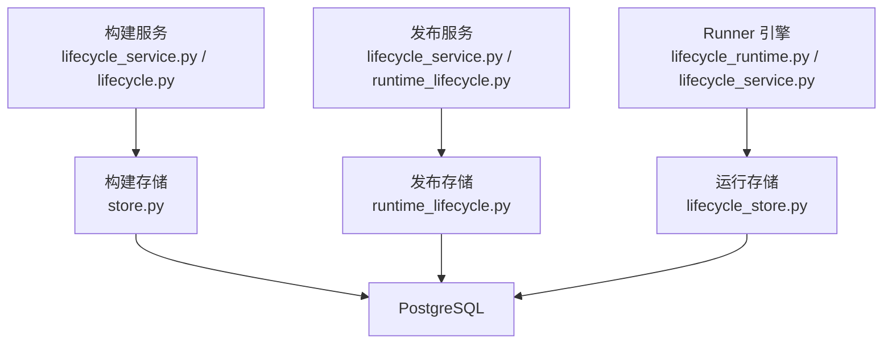
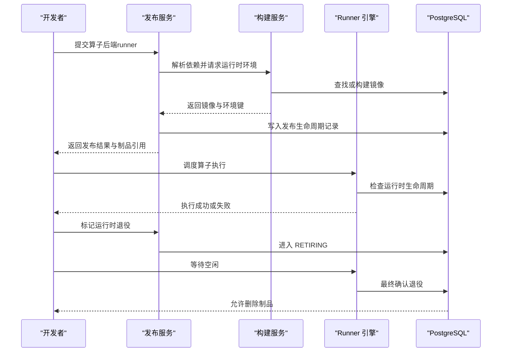
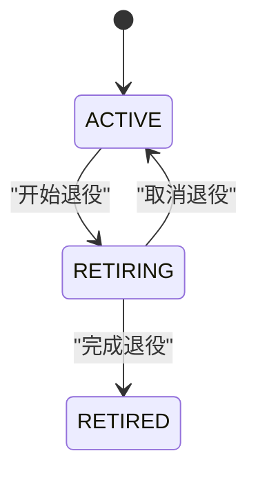
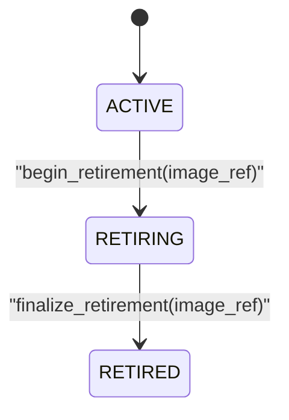
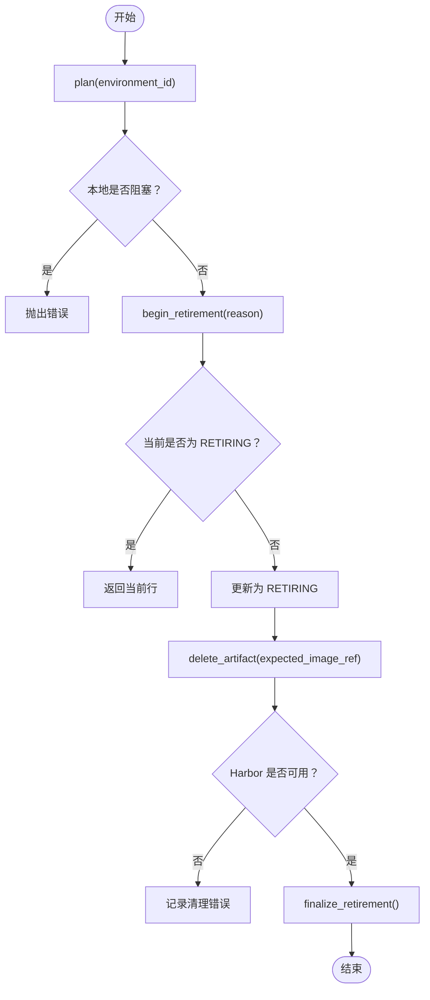
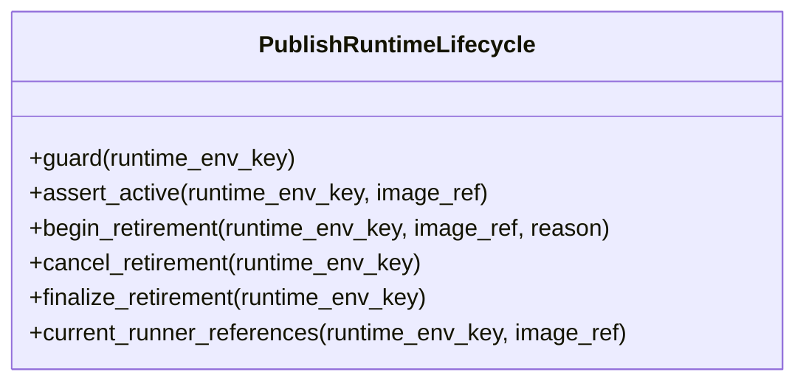
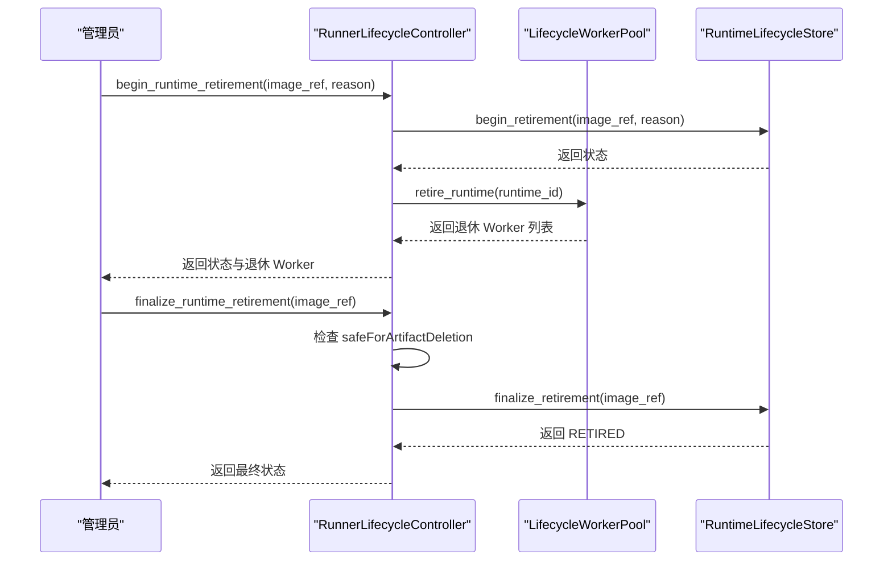
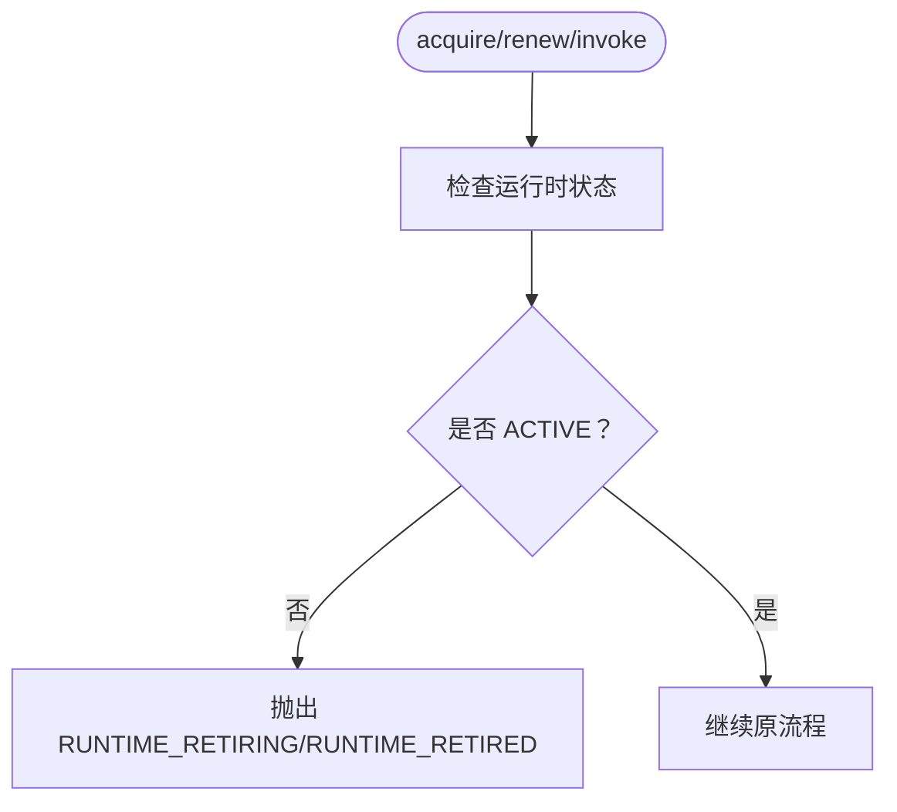
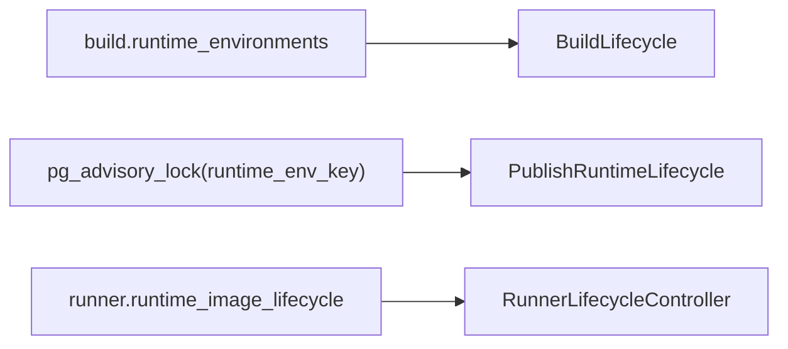
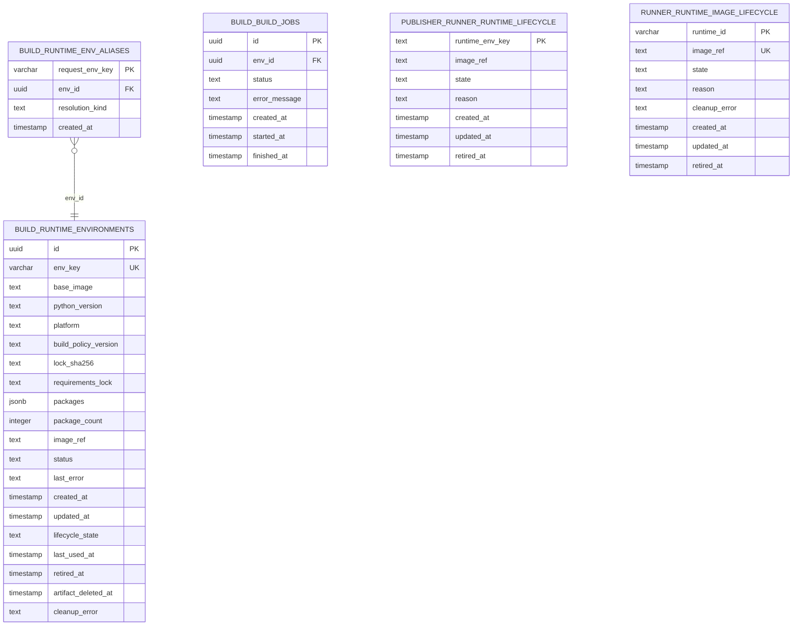

# 算子生命周期管理

<cite>
**本文引用的文件**   
- [build_service/lifecycle.py](file://build_service/lifecycle.py)
- [build_service/lifecycle_routes.py](file://build_service/lifecycle_routes.py)
- [build_service/lifecycle_service.py](file://build_service/lifecycle_service.py)
- [build_service/store.py](file://build_service/store.py)
- [publish_service/lifecycle_routes.py](file://publish_service/lifecycle_routes.py)
- [publish_service/lifecycle_service.py](file://publish_service/lifecycle_service.py)
- [publish_service/runtime_lifecycle.py](file://publish_service/runtime_lifecycle.py)
- [runner_engine/lifecycle_runtime.py](file://runner_engine/lifecycle_runtime.py)
- [runner_engine/lifecycle_service.py](file://runner_engine/lifecycle_service.py)
- [runner_engine/lifecycle_store.py](file://runner_engine/lifecycle_store.py)
- [runner_engine/model.py](file://runner_engine/model.py)
- [runner_engine/service.py](file://runner_engine/service.py)
</cite>

## 目录
1. [引言](#引言)
2. [项目结构与职责划分](#项目结构与职责划分)
3. [核心组件与角色](#核心组件与角色)
4. [系统架构总览](#系统架构总览)
5. [生命周期状态与转换](#生命周期状态与转换)
6. [详细组件分析](#详细组件分析)
7. [依赖关系与一致性保障](#依赖关系与一致性保障)
8. [数据库与持久化设计](#数据库与持久化设计)
9. [性能与可扩展性](#性能与可扩展性)
10. [故障恢复与可观测性](#故障恢复与可观测性)
11. [常见使用场景与最佳实践](#常见使用场景与最佳实践)
12. [排错指南](#排错指南)
13. [结论](#结论)

## 引言
本文围绕“算子生命周期管理”展开，覆盖从算子开发、构建、发布到运行阶段的完整生命周期。重点说明：
- 生命周期状态：创建、启动、运行、停止、销毁；以及构建侧的 ACTIVE/RETIRING/RETIRED 和运行侧的 RETIRING/RETIRED。
- 状态持久化机制：基于 PostgreSQL 的多表生命周期记录与索引。
- 生命周期控制器：构建服务、发布服务与 Runner 引擎中的控制器如何协作。
- API 调用方式、策略配置、事件处理模式。
- 数据库交互、状态同步、并发控制与故障恢复策略。
- 典型使用场景与最佳实践。

本说明面向开发者、运维人员与平台使用者，既提供高层流程图，也给出代码级映射与路径引用，便于定位实现。

## 项目结构与职责划分
本项目将生命周期管理拆分为三个关键服务层：
- 构建服务（Build Service）：负责运行时环境镜像的构建、复用与清理计划。
- 发布服务（Publish Service）：负责算子后端编译、发布产物生成，并与构建服务协同选择运行时镜像。
- Runner 引擎（Runner Engine）：负责算子执行、沙箱工作池管理、运行时镜像的生命周期门控。

**图表来源**
- [build_service/lifecycle_service.py:11-323](file://build_service/lifecycle_service.py#L11-L323)
- [build_service/lifecycle.py:45-134](file://build_service/lifecycle.py#L45-L134)
- [build_service/store.py:12-62](file://build_service/store.py#L12-L62)
- [publish_service/lifecycle_service.py:16-169](file://publish_service/lifecycle_service.py#L16-L169)
- [publish_service/runtime_lifecycle.py:7-254](file://publish_service/runtime_lifecycle.py#L7-L254)
- [runner_engine/lifecycle_runtime.py:187-397](file://runner_engine/lifecycle_runtime.py#L187-L397)
- [runner_engine/lifecycle_service.py:7-71](file://runner_engine/lifecycle_service.py#L7-L71)
- [runner_engine/lifecycle_store.py:10-151](file://runner_engine/lifecycle_store.py#L10-L151)

**章节来源**
- [build_service/lifecycle_service.py:11-323](file://build_service/lifecycle_service.py#L11-L323)
- [publish_service/lifecycle_service.py:16-169](file://publish_service/lifecycle_service.py#L16-L169)
- [runner_engine/lifecycle_runtime.py:187-397](file://runner_engine/lifecycle_runtime.py#L187-L397)

## 核心组件与角色
- 构建生命周期控制器（BuildLifecycle）：封装构建环境的清理计划、退役取消、制品删除等逻辑。
- 构建服务扩展（LifecycleBuildService/LifecycleBuildStore）：在原有构建服务上增加生命周期列与操作。
- 发布运行时生命周期（PublishRuntimeLifecycle）：通过 PG  advisory lock 保证发布与退役互斥。
- Runner 生命周期控制器（RunnerLifecycleController）：统一查询运行时状态、退役空闲 Worker、最终确认退役。
- Runner 服务扩展（LifecycleRunnerService）：在租约获取、续租、调用入口增加运行时活跃性检查。
- 运行生命周期存储（RuntimeLifecycleStore）：持久化运行时镜像的生命周期状态。

**章节来源**
- [build_service/lifecycle.py:45-134](file://build_service/lifecycle.py#L45-L134)
- [build_service/lifecycle_service.py:293-323](file://build_service/lifecycle_service.py#L293-L323)
- [publish_service/runtime_lifecycle.py:7-254](file://publish_service/runtime_lifecycle.py#L7-L254)
- [runner_engine/lifecycle_runtime.py:187-397](file://runner_engine/lifecycle_runtime.py#L187-L397)
- [runner_engine/lifecycle_service.py:7-71](file://runner_engine/lifecycle_service.py#L7-L71)
- [runner_engine/lifecycle_store.py:35-151](file://runner_engine/lifecycle_store.py#L35-L151)

## 系统架构总览
下图展示从算子开发到运行的端到端生命周期流，包括构建、发布、运行与退役的关键交互。

**图表来源**
- [publish_service/lifecycle_service.py:52-169](file://publish_service/lifecycle_service.py#L52-L169)
- [build_service/lifecycle_service.py:304-323](file://build_service/lifecycle_service.py#L304-L323)
- [runner_engine/lifecycle_runtime.py:302-359](file://runner_engine/lifecycle_runtime.py#L302-L359)
- [runner_engine/lifecycle_store.py:82-136](file://runner_engine/lifecycle_store.py#L82-L136)

## 生命周期状态与转换
### 构建侧运行时环境状态
- ACTIVE：正常运行态，允许被绑定与复用。
- RETIRING：退役中，禁止新建构建任务，允许清理制品。
- RETIRED：已退役，不可再使用，需重新激活才能再次构建。

**图表来源**
- [build_service/lifecycle.py:9-11](file://build_service/lifecycle.py#L9-L11)
- [build_service/lifecycle_service.py:216-277](file://build_service/lifecycle_service.py#L216-L277)

### 运行侧运行时镜像状态
- 默认未记录：视为 ACTIVE。
- RETIRING：不允许新租约、续租、调用；允许清理空闲 Worker。
- RETIRED：永久退役，不可重新激活。

**图表来源**
- [runner_engine/lifecycle_store.py:10-28](file://runner_engine/lifecycle_store.py#L10-L28)
- [runner_engine/lifecycle_runtime.py:302-359](file://runner_engine/lifecycle_runtime.py#L302-L359)

## 详细组件分析

### 构建服务生命周期控制器
构建侧生命周期由 BuildLifecycle 与 LifecycleBuildStore 共同实现：
- plan：读取环境信息，计算本地阻塞条件（存在活动构建任务或处于 PENDING/BUILDING/VERIFYING）。
- begin_retirement：校验无活动构建后进入 RETIRING。
- cancel_retirement：仅允许从 RETIRING 回到 ACTIVE。
- delete_artifact：在 RETIRING 且无活动构建时删除 Harbor 制品，最终进入 RETIRED。

**图表来源**
- [build_service/lifecycle.py:50-134](file://build_service/lifecycle.py#L50-L134)
- [build_service/lifecycle_service.py:216-290](file://build_service/lifecycle_service.py#L216-L290)

**章节来源**
- [build_service/lifecycle.py:45-134](file://build_service/lifecycle.py#L45-L134)
- [build_service/lifecycle_service.py:293-323](file://build_service/lifecycle_service.py#L293-L323)

### 发布服务生命周期控制器
发布侧通过 PublishRuntimeLifecycle 对 runner 运行时进行保护：
- guard：使用 PG advisory lock 确保同一 runtime_env_key 的发布与退役串行。
- assert_active：若存在生命周期记录且 image_ref 不一致或处于 RETIRING/RETIRED，则拒绝发布。
- begin_retirement/cancel_retirement/finalize_retirement：维护 publish.runner_runtime_lifecycle 表。

**图表来源**
- [publish_service/runtime_lifecycle.py:7-254](file://publish_service/runtime_lifecycle.py#L7-L254)

**章节来源**
- [publish_service/lifecycle_service.py:16-169](file://publish_service/lifecycle_service.py#L16-L169)
- [publish_service/runtime_lifecycle.py:7-254](file://publish_service/runtime_lifecycle.py#L7-L254)

### Runner 引擎生命周期控制器
Runner 侧通过 RunnerLifecycleController 与 LifecycleWorkerPool 协同：
- runtime_image_status：汇总运行时状态、发布版本、活跃调用、空闲 Worker、托管沙箱等。
- begin_runtime_retirement：进入 RETIRING，回收空闲 Worker。
- cancel_runtime_retirement：取消退役（RETIRED 不可重新激活）。
- finalize_runtime_retirement：在所有资源释放后进入 RETIRED。

**图表来源**
- [runner_engine/lifecycle_runtime.py:187-397](file://runner_engine/lifecycle_runtime.py#L187-L397)
- [runner_engine/lifecycle_store.py:82-136](file://runner_engine/lifecycle_store.py#L82-L136)

**章节来源**
- [runner_engine/lifecycle_runtime.py:187-397](file://runner_engine/lifecycle_runtime.py#L187-L397)

### Runner 服务扩展
LifecycleRunnerService 在基础 RunnerService 之上增加运行时活跃性检查：
- acquire_lease：获取租约前检查运行时状态。
- renew_lease：续租前检查运行时状态。
- invoke：调用前检查运行时状态，并在沙箱获取边界再次检查。

**图表来源**
- [runner_engine/lifecycle_service.py:7-71](file://runner_engine/lifecycle_service.py#L7-L71)

**章节来源**
- [runner_engine/lifecycle_service.py:7-71](file://runner_engine/lifecycle_service.py#L7-L71)
- [runner_engine/service.py:146-456](file://runner_engine/service.py#L146-L456)

## 依赖关系与一致性保障
- 构建侧：LifecycleBuildStore 在 build.runtime_environments 表中增加 lifecycle_state 等列，并通过索引优化查询。
- 发布侧：PublishRuntimeLifecycle 使用 pg_advisory_lock 保证同一 runtime_env_key 的发布与退役互斥。
- 运行侧：RuntimeLifecycleStore 以 image_ref 哈希作为 runtime_id，避免重复记录，并提供 begin/cancel/finalize 原子操作。

**图表来源**
- [build_service/lifecycle_service.py:14-50](file://build_service/lifecycle_service.py#L14-L50)
- [publish_service/runtime_lifecycle.py:42-66](file://publish_service/runtime_lifecycle.py#L42-L66)
- [runner_engine/lifecycle_store.py:31-33](file://runner_engine/lifecycle_store.py#L31-L33)

**章节来源**
- [build_service/lifecycle_service.py:14-50](file://build_service/lifecycle_service.py#L14-L50)
- [publish_service/runtime_lifecycle.py:42-66](file://publish_service/runtime_lifecycle.py#L42-L66)
- [runner_engine/lifecycle_store.py:31-33](file://runner_engine/lifecycle_store.py#L31-L33)

## 数据库与持久化设计
- 构建侧表结构：
  - build.runtime_environments：运行时环境主表，包含 packages JSONB、status、image_ref 等。
  - build.runtime_env_aliases：请求键到环境 ID 的别名映射。
  - build.build_jobs：构建任务历史。
- 发布侧表结构：
  - publish.runner_runtime_lifecycle：发布侧运行时生命周期记录。
- 运行侧表结构：
  - runner.runtime_image_lifecycle：运行侧运行时镜像生命周期记录。

**图表来源**
- [build_service/store.py:12-62](file://build_service/store.py#L12-L62)
- [build_service/lifecycle_service.py:14-50](file://build_service/lifecycle_service.py#L14-L50)
- [publish_service/runtime_lifecycle.py:19-36](file://publish_service/runtime_lifecycle.py#L19-L36)
- [runner_engine/lifecycle_store.py:10-28](file://runner_engine/lifecycle_store.py#L10-L28)

**章节来源**
- [build_service/store.py:12-62](file://build_service/store.py#L12-L62)
- [build_service/lifecycle_service.py:14-50](file://build_service/lifecycle_service.py#L14-L50)
- [publish_service/runtime_lifecycle.py:19-36](file://publish_service/runtime_lifecycle.py#L19-L36)
- [runner_engine/lifecycle_store.py:10-28](file://runner_engine/lifecycle_store.py#L10-L28)

## 性能与可扩展性
- 构建侧：
  - 使用 GIN 索引加速 packages JSONB 查询。
  - 复合索引优化按 base_image/python_version/platform/build_policy_version/status/package_count/created_at 的排序与过滤。
- 发布侧：
  - advisory lock 粒度为 runtime_env_key，避免全局锁竞争。
- 运行侧：
  - RuntimeLifecycleStore 连接池最小 1、最大 4，降低连接开销。
  - LifecycleWorkerPool 快照聚合 idleWorkers 与 acquiringByRuntime，便于监控与决策。

**章节来源**
- [build_service/store.py:34-40](file://build_service/store.py#L34-L40)
- [build_service/store.py:110-122](file://build_service/store.py#L110-L122)
- [publish_service/runtime_lifecycle.py:42-66](file://publish_service/runtime_lifecycle.py#L42-L66)
- [runner_engine/lifecycle_store.py:36-46](file://runner_engine/lifecycle_store.py#L36-L46)
- [runner_engine/lifecycle_runtime.py:48-81](file://runner_engine/lifecycle_runtime.py#L48-L81)

## 故障恢复与可观测性
- 构建侧：
  - mark_failed 保留错误消息（截断至 8192 字节），支持 retry 接口重置 FAILED 环境。
  - record_cleanup_error 记录清理错误，便于排查 Harbor 删除失败。
- 发布侧：
  - current_runner_references 列出仍引用该运行时的算子契约，辅助判断退役安全性。
- 运行侧：
  - runtime_snapshot 输出活跃调用、空闲 Worker、acquiringByRuntime 与最近生命周期记录。
  - RunnerLifecycleController.runtime_image_status 汇总托管沙箱数量与状态，用于判断 safeForArtifactDeletion。

**章节来源**
- [build_service/store.py:311-331](file://build_service/store.py#L311-L331)
- [build_service/lifecycle_service.py:279-290](file://build_service/lifecycle_service.py#L279-L290)
- [publish_service/runtime_lifecycle.py:94-148](file://publish_service/runtime_lifecycle.py#L94-L148)
- [runner_engine/lifecycle_runtime.py:373-397](file://runner_engine/lifecycle_runtime.py#L373-L397)
- [runner_engine/lifecycle_runtime.py:239-300](file://runner_engine/lifecycle_runtime.py#L239-L300)

## 常见使用场景与最佳实践

### 场景一：构建新的运行时环境
- 步骤：
  1. 调用构建服务 resolve(requirements)。
  2. 若存在兼容 superset，直接复用；否则创建 exact 环境并触发构建。
  3. 构建完成后验证镜像并标记 READY。
- 注意事项：
  - 若环境处于 FAILED，需显式重试。
  - 若环境处于 RETIRING/RETIRED，exact 环境会被拒绝或自动重新激活。

**章节来源**
- [build_service/service.py:31-120](file://build_service/service.py#L31-L120)
- [build_service/lifecycle_service.py:90-107](file://build_service/lifecycle_service.py#L90-L107)

### 场景二：发布算子后端（runner）
- 步骤：
  1. 编译后端契约并创建发布任务。
  2. 通过构建服务解析依赖并获取运行时镜像。
  3. 使用 PublishRuntimeLifecycle.guard 保护发布过程。
  4. 发布成功后写入制品引用与结果。
- 注意事项：
  - 若运行时处于 RETIRING 或与预期 image_ref 不一致，发布将被拒绝。

**章节来源**
- [publish_service/lifecycle_service.py:52-169](file://publish_service/lifecycle_service.py#L52-L169)
- [publish_service/runtime_lifecycle.py:79-92](file://publish_service/runtime_lifecycle.py#L79-L92)

### 场景三：退役运行时镜像
- 步骤：
  1. 调用 RunnerLifecycleController.begin_runtime_retirement(image_ref, reason)。
  2. 等待空闲 Worker 回收与活跃调用结束。
  3. 调用 finalize_runtime_retirement(image_ref) 完成退役。
- 注意事项：
  - 仅在 safeForArtifactDeletion 为真时允许删除制品。
  - RETIRED 状态不可重新激活。

**章节来源**
- [runner_engine/lifecycle_runtime.py:302-359](file://runner_engine/lifecycle_runtime.py#L302-L359)

### 场景四：构建侧制品清理
- 步骤：
  1. 调用构建服务 retire_environment(environment_id, reason)。
  2. 等待无活动构建任务。
  3. 调用 delete_environment_artifact(environment_id, expected_image_ref)。
  4. 清理完成后进入 RETIRED。
- 注意事项：
  - 必须提供 expected_image_ref 防止竞态。
  - 若 Harbor 不可用，会记录清理错误。

**章节来源**
- [build_service/lifecycle.py:65-134](file://build_service/lifecycle.py#L65-L134)
- [build_service/lifecycle_routes.py:87-108](file://build_service/lifecycle_routes.py#L87-L108)

### 最佳实践
- 在退役前确保无活跃调用与空闲 Worker。
- 发布与退役使用 advisory lock 保护，避免竞态。
- 使用 runtime_image_status 与 runtime_snapshot 做可观测性监控。
- 对构建失败的环境使用 retry 接口，而非盲目重建。
- 在删除制品前确认 safeForArtifactDeletion 为真。

## 排错指南
- 构建侧：
  - 若 retire 报错“本地阻塞”，检查是否存在活动构建任务或处于 PENDING/BUILDING/VERIFYING。
  - 若 delete_artifact 报错“Harbor 删除禁用”，检查构建服务环境变量与凭证。
- 发布侧：
  - 若发布报错“RUNTIME_RETIRING”，检查 PublishRuntimeLifecycle.assert_active 的结果。
  - 若 publishedReferences 非空，说明仍有算子引用该运行时，需先解除引用。
- 运行侧：
  - 若 acquire/renew/invoke 报错“RUNTIME_RETIRING/RUNTIME_RETIRED”，检查 RuntimeLifecycleStore 的状态。
  - 若 finalize 报错“仍存在活跃调用/空闲 Worker/托管沙箱”，等待资源释放或主动 retire_idle_worker。

**章节来源**
- [build_service/lifecycle.py:65-134](file://build_service/lifecycle.py#L65-L134)
- [publish_service/runtime_lifecycle.py:79-92](file://publish_service/runtime_lifecycle.py#L79-L92)
- [runner_engine/lifecycle_service.py:19-32](file://runner_engine/lifecycle_service.py#L19-L32)
- [runner_engine/lifecycle_runtime.py:340-359](file://runner_engine/lifecycle_runtime.py#L340-L359)

## 结论
本项目的算子生命周期管理通过构建、发布、运行三层服务的协同，实现了从环境构建、镜像发布到执行调度的全链路可控。借助 PostgreSQL 多表持久化与 advisory lock，系统在并发与一致性方面具备良好保障。结合可观测性与故障恢复机制，平台可在大规模算子部署与退役场景中保持稳健运行。建议在实际使用中遵循退役前的资源检查、发布与退役的串行保护、以及构建失败的显式重试等最佳实践。