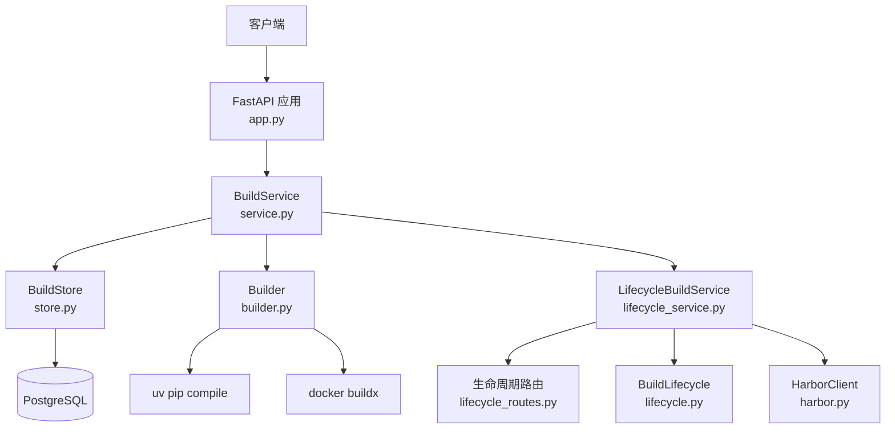
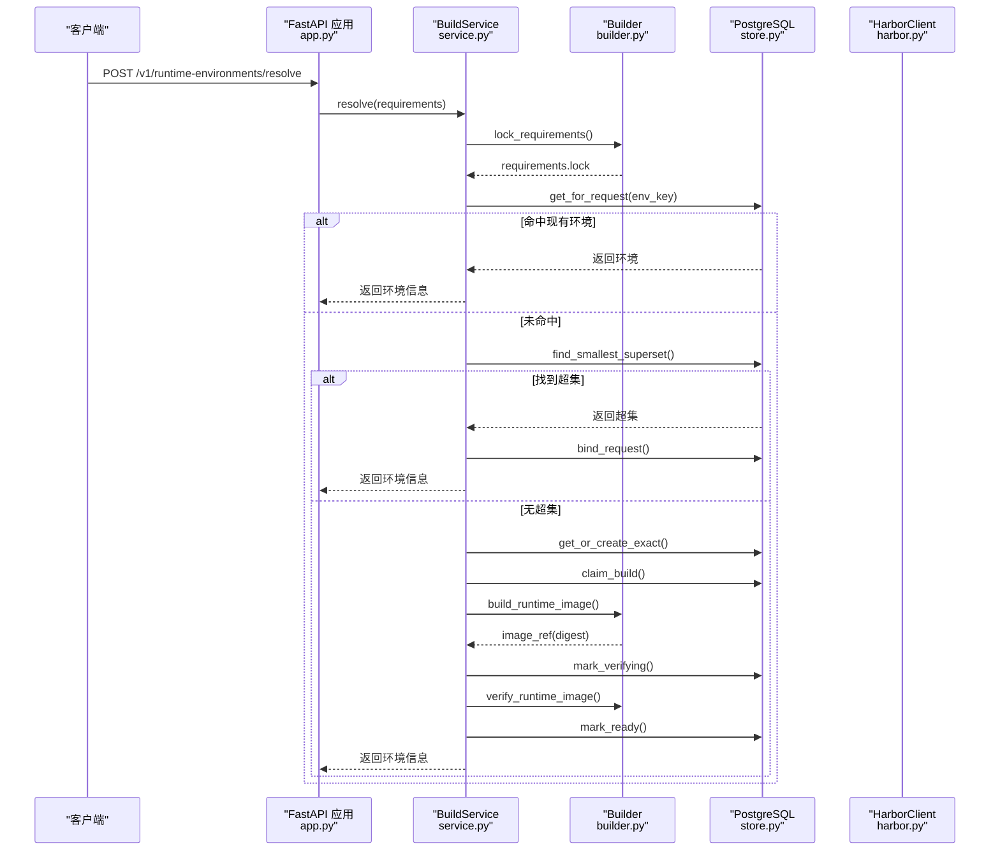
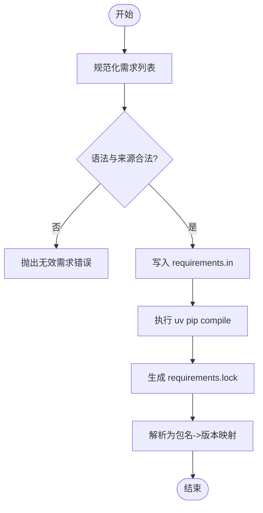
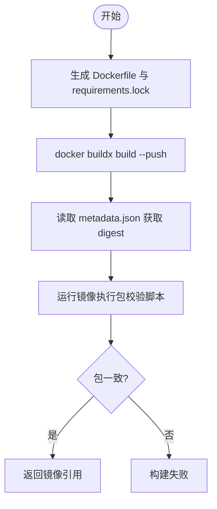
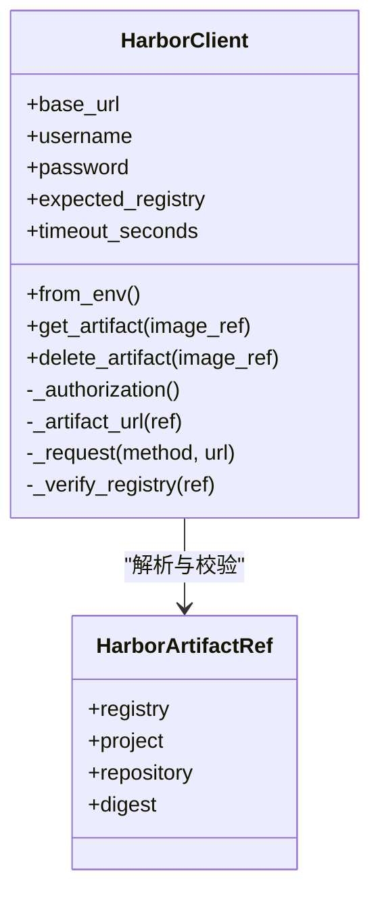
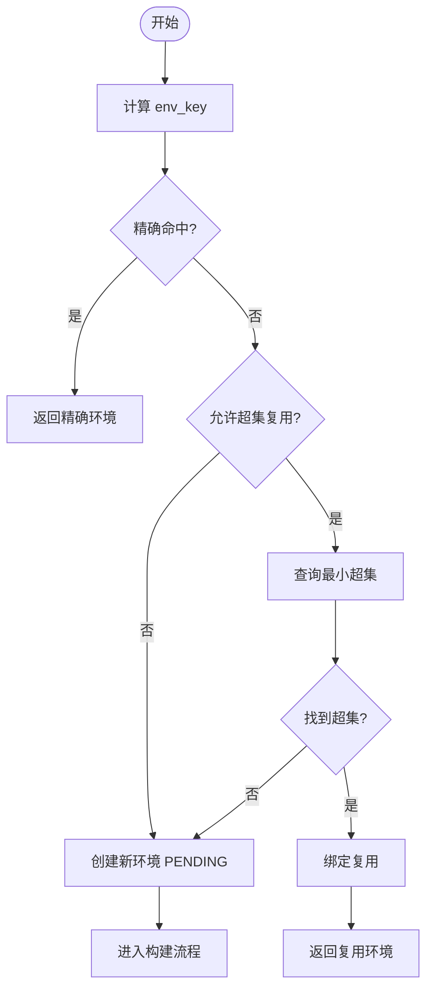
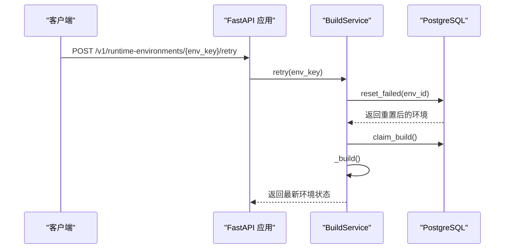
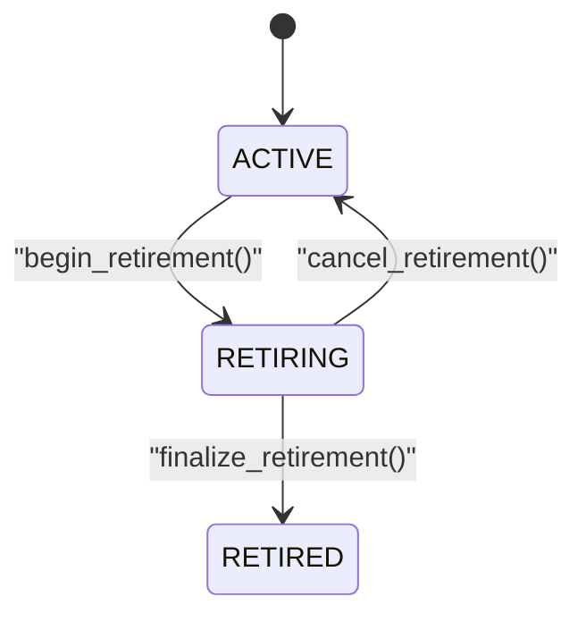
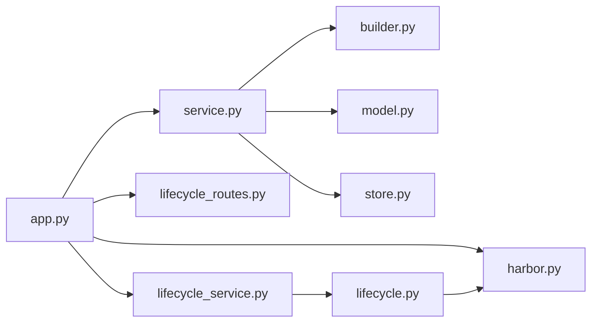

# 自动化构建

<cite>
**本文引用的文件**   
- [build_service/app.py](file://build_service/app.py)
- [build_service/service.py](file://build_service/service.py)
- [build_service/builder.py](file://build_service/builder.py)
- [build_service/model.py](file://build_service/model.py)
- [build_service/store.py](file://build_service/store.py)
- [build_service/lifecycle_service.py](file://build_service/lifecycle_service.py)
- [build_service/lifecycle_routes.py](file://build_service/lifecycle_routes.py)
- [build_service/lifecycle.py](file://build_service/lifecycle.py)
- [build_service/harbor.py](file://build_service/harbor.py)
- [images/runner.Dockerfile](file://images/runner.Dockerfile)
- [images/runtime.Dockerfile](file://images/runtime.Dockerfile)
</cite>

## 目录
1. [简介](#简介)
2. [项目结构](#项目结构)
3. [核心组件](#核心组件)
4. [架构总览](#架构总览)
5. [详细组件分析](#详细组件分析)
6. [依赖关系分析](#依赖关系分析)
7. [性能与优化](#性能与优化)
8. [故障排查指南](#故障排查指南)
9. [结论](#结论)
10. [附录：API 与配置参考](#附录api-与配置参考)

## 简介
本仓库的“自动化构建”能力由 build_service 提供，负责 Python 依赖解析、Docker 镜像构建、镜像版本管理以及 Harbor 镜像仓库集成。系统通过 FastAPI 暴露 REST API，使用 PostgreSQL 持久化构建状态与环境别名，调用外部工具 uv 和 docker buildx 完成依赖锁定与多平台镜像构建，并通过 Harbor v2 API 进行制品查询与清理。

该服务支持：
- 基于 requirements 的确定性依赖解析与锁定
- 基于 Docker 多阶段构建的可信运行时镜像
- 基于 digest 的版本管理与镜像校验
- 最小超集复用与精确匹配的环境复用
- 构建失败重试与生命周期清理（退役、删除制品）

## 项目结构
build_service 是本次文档的核心模块，围绕以下职责组织代码：
- app.py：FastAPI 应用入口、健康检查、环境解析与重试接口
- service.py：构建主流程编排（依赖锁定、镜像构建、镜像校验、状态更新）
- builder.py：依赖锁定、镜像构建与镜像内包校验
- model.py：构建规格模型与 env_key 生成
- store.py：PostgreSQL 数据访问与状态机
- lifecycle_service.py / lifecycle_routes.py / lifecycle.py：生命周期扩展（ACTIVE/RETIRING/RETIRED）
- harbor.py：Harbor v2 API 客户端（制品查询与删除）
- images/*：基础 Runner 镜像与运行时镜像模板

**图表来源**
- [build_service/app.py:106-181](file://build_service/app.py#L106-L181)
- [build_service/service.py:26-216](file://build_service/service.py#L26-L216)
- [build_service/builder.py:84-158](file://build_service/builder.py#L84-L158)
- [build_service/store.py:65-331](file://build_service/store.py#L65-L331)
- [build_service/lifecycle_service.py:293-323](file://build_service/lifecycle_service.py#L293-L323)
- [build_service/lifecycle_routes.py:34-108](file://build_service/lifecycle_routes.py#L34-L108)
- [build_service/lifecycle.py:45-134](file://build_service/lifecycle.py#L45-L134)
- [build_service/harbor.py:57-196](file://build_service/harbor.py#L57-L196)

**章节来源**
- [build_service/app.py:106-181](file://build_service/app.py#L106-L181)
- [build_service/service.py:26-216](file://build_service/service.py#L26-L216)
- [build_service/builder.py:84-158](file://build_service/builder.py#L84-L158)
- [build_service/store.py:65-331](file://build_service/store.py#L65-L331)
- [build_service/lifecycle_service.py:293-323](file://build_service/lifecycle_service.py#L293-L323)
- [build_service/lifecycle_routes.py:34-108](file://build_service/lifecycle_routes.py#L34-L108)
- [build_service/lifecycle.py:45-134](file://build_service/lifecycle.py#L45-L134)
- [build_service/harbor.py:57-196](file://build_service/harbor.py#L57-L196)

## 核心组件
- 依赖解析与锁定
  - 使用 packaging 校验需求合法性，拒绝 URL/VCS/path 依赖
  - 调用 uv pip compile 生成带哈希的 requirements.lock
  - 将 lock 文本解析为规范化包名到版本的映射，用于后续镜像校验
- 镜像构建与校验
  - 动态生成 Dockerfile，采用两阶段构建：依赖安装阶段与干净基础镜像阶段
  - 使用 docker buildx 构建并推送镜像，从 metadata 中读取 sha256 digest
  - 在运行态容器内扫描 /opt/python-deps，验证包名与版本一致
- 版本管理与缓存策略
  - 基于 base_image、python_version、platform、policy_version、lock_sha256 计算 env_key
  - 精确匹配优先；若允许则尝试复用包含当前依赖的最小超集
  - 通过 GIN 索引与 package_count 排序实现高效超集查找
- 生命周期与清理
  - ACTIVE/RETIRING/RETIRED 三态控制
  - 退役前阻塞活跃构建任务，确保一致性
  - 通过 Harbor 删除制品，记录清理错误与时间戳

**章节来源**
- [build_service/builder.py:62-158](file://build_service/builder.py#L62-L158)
- [build_service/model.py:17-71](file://build_service/model.py#L17-L71)
- [build_service/service.py:31-119](file://build_service/service.py#L31-L119)
- [build_service/store.py:146-168](file://build_service/store.py#L146-L168)
- [build_service/lifecycle.py:45-134](file://build_service/lifecycle.py#L45-L134)

## 架构总览
构建流水线的关键步骤如下：
1. 客户端调用 /v1/runtime-environments/resolve 提交依赖列表
2. 服务层调用 uv 生成 requirements.lock，构造 RuntimeBuildSpec
3. 存储层根据 env_key 查找已有环境或创建新记录
4. 若允许且存在兼容超集，直接绑定复用
5. 否则进入构建：claim_build -> 构建镜像 -> 标记 VERIFYING -> 校验镜像 -> 标记 READY
6. 失败时记录 last_error 与 job 历史，支持显式重试
7. 生命周期管理：退役、取消退役、删除制品

**图表来源**
- [build_service/app.py:140-149](file://build_service/app.py#L140-L149)
- [build_service/service.py:31-119](file://build_service/service.py#L31-L119)
- [build_service/builder.py:84-158](file://build_service/builder.py#L84-L158)
- [build_service/store.py:134-214](file://build_service/store.py#L134-L214)

**章节来源**
- [build_service/app.py:140-149](file://build_service/app.py#L140-L149)
- [build_service/service.py:31-119](file://build_service/service.py#L31-L119)
- [build_service/builder.py:84-158](file://build_service/builder.py#L84-L158)
- [build_service/store.py:134-214](file://build_service/store.py#L134-L214)

## 详细组件分析

### 依赖解析机制
- 输入校验
  - 去除空行与换行符，拒绝以“-”开头的参数
  - 使用 packaging.requirements.Requirement 校验语法
  - 禁止 URL/VCS/path 依赖，避免不可控源
- 依赖锁定
  - 临时写入 requirements.in，调用 uv pip compile 生成 requirements.lock
  - 启用 --generate-hashes 保证可重复性
  - 支持通过 UV_DEFAULT_INDEX 指定默认索引
- 规范包映射
  - 解析 lock 文本为规范化包名到版本的字典
  - 检测冲突版本并抛出异常

**图表来源**
- [build_service/builder.py:62-119](file://build_service/builder.py#L62-L119)
- [build_service/model.py:17-37](file://build_service/model.py#L17-L37)

**章节来源**
- [build_service/builder.py:62-119](file://build_service/builder.py#L62-L119)
- [build_service/model.py:17-37](file://build_service/model.py#L17-L37)

### Docker 镜像构建过程
- 动态 Dockerfile
  - 第一阶段 deps：以 RUNNER_BASE 为基础，安装 requirements.lock 到 /opt/python-deps
  - 第二阶段 final：复制依赖目录，设置 RUNNER_DEPENDENCY_ROOT 与 PYTHONPATH
- 构建与推送
  - 使用 docker buildx build，指定 platform 与 RUNNER_BASE 构建参数
  - 输出 metadata.json，提取 containerimage.digest 作为镜像引用
- 镜像校验
  - 启动镜像容器，扫描 /opt/python-deps 下已安装包
  - 与 spec.packages 比较，不一致则构建失败

**图表来源**
- [build_service/builder.py:122-205](file://build_service/builder.py#L122-L205)
- [images/runtime.Dockerfile:21-65](file://images/runtime.Dockerfile#L21-L65)

**章节来源**
- [build_service/builder.py:122-205](file://build_service/builder.py#L122-L205)
- [images/runtime.Dockerfile:21-65](file://images/runtime.Dockerfile#L21-L65)

### Harbor 镜像仓库集成
- 客户端初始化
  - 从环境变量读取 BUILD_HARBOR_URL、用户名、密码、CA 文件、是否不安全模式
  - 可选限制 expected_registry，防止跨仓库误操作
- 制品查询与删除
  - 解析镜像引用为 registry/project/repository@sha256:...
  - 调用 Harbor v2 API 查询或删除制品
  - 对 404/409 等状态码进行专门处理，抛出 HarborError/HarborConflict
- 生命周期清理
  - 退役流程中调用 delete_artifact，记录清理错误并标记需要垃圾回收

**图表来源**
- [build_service/harbor.py:21-54](file://build_service/harbor.py#L21-L54)
- [build_service/harbor.py:57-196](file://build_service/harbor.py#L57-L196)

**章节来源**
- [build_service/harbor.py:57-196](file://build_service/harbor.py#L57-L196)
- [build_service/lifecycle.py:91-134](file://build_service/lifecycle.py#L91-L134)

### 版本管理与缓存策略
- env_key 生成
  - 基于 schema、base_image、python_version、platform、lock_sha256、policy_version 计算 SHA256
  - base_image 必须为 repo@sha256:<digest> 形式
- 缓存策略
  - 精确匹配：相同 env_key 直接复用
  - 超集复用：当 allow_superset_reuse 开启时，寻找 packages @> 当前包的已就绪环境，按 package_count 升序选择最小超集
- 数据库索引
  - GIN 索引 on packages 提升超集查询效率
  - 复合索引 on (base_image, python_version, platform, policy_version, status, package_count, created_at) 加速排序

**图表来源**
- [build_service/model.py:40-71](file://build_service/model.py#L40-L71)
- [build_service/service.py:62-119](file://build_service/service.py#L62-L119)
- [build_service/store.py:146-168](file://build_service/store.py#L146-L168)

**章节来源**
- [build_service/model.py:40-71](file://build_service/model.py#L40-L71)
- [build_service/service.py:62-119](file://build_service/service.py#L62-L119)
- [build_service/store.py:146-168](file://build_service/store.py#L146-L168)

### 构建失败重试机制
- 失败状态
  - 构建或校验失败时，环境状态置为 FAILED，记录 last_error
  - 构建作业表保留历史，便于审计
- 显式重试
  - 仅允许对 FAILED 环境调用重试接口
  - 重置环境状态为 PENDING，清空 image_ref 与 last_error
  - 重新进入构建流程，创建新的 build_jobs 记录

**图表来源**
- [build_service/app.py:161-178](file://build_service/app.py#L161-L178)
- [build_service/service.py:121-152](file://build_service/service.py#L121-L152)
- [build_service/store.py:226-271](file://build_service/store.py#L226-L271)

**章节来源**
- [build_service/app.py:161-178](file://build_service/app.py#L161-L178)
- [build_service/service.py:121-152](file://build_service/service.py#L121-L152)
- [build_service/store.py:226-271](file://build_service/store.py#L226-L271)

### 生命周期与清理
- 状态定义
  - ACTIVE：正常可用
  - RETIRING：正在退役，不允许新建绑定
  - RETIRED：已退役，需重建或等待清理完成
- 退役流程
  - 检查是否存在活跃构建任务，若有则阻止退役
  - 进入 RETIRING，记录 cleanup_error 以便追踪
  - 删除 Harbor 制品后，最终转为 RETIRED，并清理别名
- 取消退役
  - 仅允许从 RETIRING 回到 ACTIVE

**图表来源**
- [build_service/lifecycle.py:9-12](file://build_service/lifecycle.py#L9-L12)
- [build_service/lifecycle.py:65-134](file://build_service/lifecycle.py#L65-L134)
- [build_service/lifecycle_service.py:216-290](file://build_service/lifecycle_service.py#L216-L290)

**章节来源**
- [build_service/lifecycle.py:9-12](file://build_service/lifecycle.py#L9-L12)
- [build_service/lifecycle.py:65-134](file://build_service/lifecycle.py#L65-L134)
- [build_service/lifecycle_service.py:216-290](file://build_service/lifecycle_service.py#L216-L290)

## 依赖关系分析
- 模块耦合
  - app.py 依赖 service.py、lifecycle_routes.py、lifecycle_service.py、harbor.py
  - service.py 依赖 builder.py、model.py、store.py
  - lifecycle_service.py 继承 store.BuildStore，扩展生命周期字段与查询
  - lifecycle.py 依赖 harbor.py 进行制品删除
- 外部依赖
  - uv：依赖锁定
  - docker/buildx：镜像构建与推送
  - PostgreSQL：状态与元数据持久化
  - Harbor v2 API：制品查询与删除

**图表来源**
- [build_service/app.py:13-16](file://build_service/app.py#L13-L16)
- [build_service/service.py:6-8](file://build_service/service.py#L6-L8)
- [build_service/lifecycle_service.py:5-8](file://build_service/lifecycle_service.py#L5-L8)
- [build_service/lifecycle.py:6](file://build_service/lifecycle.py#L6)

**章节来源**
- [build_service/app.py:13-16](file://build_service/app.py#L13-L16)
- [build_service/service.py:6-8](file://build_service/service.py#L6-L8)
- [build_service/lifecycle_service.py:5-8](file://build_service/lifecycle_service.py#L5-L8)
- [build_service/lifecycle.py:6](file://build_service/lifecycle.py#L6)

## 性能与优化
- 依赖解析
  - 使用 uv pip compile 替代传统 pip-tools，显著提升解析速度
  - 通过 UV_DEFAULT_INDEX 指向内部镜像源，减少网络延迟
- 镜像构建
  - 多阶段构建隔离依赖安装与运行环境，减小最终镜像体积
  - 使用 docker buildx 支持多平台构建，结合缓存层提高重复构建效率
- 缓存策略
  - 精确匹配优先，减少不必要的构建
  - 超集复用降低依赖差异带来的镜像膨胀
  - GIN 索引与 package_count 排序优化超集查询
- 构建监控
  - 通过 build_jobs 表跟踪每个环境的构建作业状态与耗时
  - 日志记录关键节点：依赖锁定、镜像构建、镜像校验、状态变更

建议：
- 合理设置 BUILD_ALLOW_SUPERSET_REUSE，平衡复用率与镜像大小
- 定期清理 RETIRED 环境及其别名，避免数据库膨胀
- 监控 Harbor 制品数量与垃圾回收情况，避免仓库空间耗尽

[本节为通用指导，不直接分析具体文件]

## 故障排查指南
- 依赖解析失败
  - 检查 requirements 是否包含 URL/VCS/path 依赖
  - 确认 uv 可用且网络可达
  - 查看日志中的 invalid requirement 或 unsupported requirement 错误
- 镜像构建失败
  - 检查 docker 与 buildx 是否正常
  - 确认 RUNNER_BASE 镜像可拉取且平台匹配
  - 查看构建日志与最后错误消息
- 镜像校验失败
  - 检查 runtime.Dockerfile 中依赖安装路径与 PYTHONPATH 配置
  - 确认 /opt/python-deps 下的包名与版本与 spec.packages 一致
- Harbor 集成问题
  - 检查 BUILD_HARBOR_URL、用户名、密码是否正确
  - 若启用 expected_registry，确认镜像引用仓库与之匹配
  - 关注 409 冲突错误，可能因制品仍被引用或受保护
- 生命周期清理失败
  - 检查是否有活跃构建任务阻止退役
  - 查看 cleanup_error 字段定位 Harbor 删除失败原因
  - 必要时手动清理别名与制品，再恢复环境状态

**章节来源**
- [build_service/builder.py:62-119](file://build_service/builder.py#L62-L119)
- [build_service/builder.py:122-205](file://build_service/builder.py#L122-L205)
- [build_service/harbor.py:129-196](file://build_service/harbor.py#L129-L196)
- [build_service/lifecycle.py:65-134](file://build_service/lifecycle.py#L65-L134)

## 结论
本自动化构建系统通过严格的依赖锁定、可信的多阶段镜像构建与基于 digest 的版本管理，确保了构建结果的可重复性与安全性。结合 PostgreSQL 的状态机与 Harbor 制品管理，提供了完整的构建、复用、重试与生命周期管理能力。通过合理的缓存策略与索引优化，系统在大规模环境下仍能保持良好性能。

[本节为总结，不直接分析具体文件]

## 附录：API 与配置参考

### 主要 API
- 健康检查
  - GET /health
- 环境解析
  - POST /v1/runtime-environments/resolve
  - 请求体：requirements 列表
  - 响应：environmentId、envKey、image、status、canRetry 等
- 环境查询
  - GET /v1/runtime-environments/{env_key}
- 环境重试
  - POST /v1/runtime-environments/{env_key}/retry
- 生命周期管理（需管理员令牌）
  - GET /v1/admin/runtime-environments/{environment_id}/cleanup-plan
  - POST /v1/admin/runtime-environments/{environment_id}/retire
  - POST /v1/admin/runtime-environments/{environment_id}/cancel-retirement
  - DELETE /v1/admin/runtime-environments/{environment_id}/artifact

**章节来源**
- [build_service/app.py:128-181](file://build_service/app.py#L128-L181)
- [build_service/lifecycle_routes.py:34-108](file://build_service/lifecycle_routes.py#L34-L108)

### 关键环境变量
- 构建服务
  - BUILD_DATABASE_URL：PostgreSQL 连接字符串
  - BUILD_RUNNER_BASE_IMAGE：基础镜像引用（必须为 repo@sha256:<digest>）
  - BUILD_REGISTRY_REPO：目标镜像仓库地址
  - BUILD_PYTHON_VERSION：Python 版本
  - BUILD_PLATFORM：目标平台（如 linux/amd64）
  - BUILD_UV_PYTHON_PLATFORM：uv 使用的 Python 平台标识
  - BUILD_POLICY_VERSION：构建策略版本
  - UV_DEFAULT_INDEX：默认 PyPI 索引
  - BUILD_ALLOW_SUPERSET_REUSE：是否允许超集复用
  - BUILD_LOG_LEVEL：日志级别
  - BUILD_LISTEN_HOST/BUILD_LISTEN_PORT：监听地址与端口
- Harbor
  - BUILD_HARBOR_URL：Harbor 服务地址
  - BUILD_HARBOR_USERNAME/BUILD_HARBOR_PASSWORD：认证凭据
  - BUILD_HARBOR_REGISTRY：期望的仓库域名（可选）
  - BUILD_HARBOR_CA_FILE：CA 证书路径（可选）
  - BUILD_HARBOR_INSECURE：是否禁用 TLS 校验（可选）
- 管理员令牌
  - BUILD_ADMIN_TOKEN：生命周期管理接口的 Bearer Token

**章节来源**
- [build_service/app.py:65-99](file://build_service/app.py#L65-L99)
- [build_service/harbor.py:87-109](file://build_service/harbor.py#L87-L109)
- [build_service/lifecycle_routes.py:18-31](file://build_service/lifecycle_routes.py#L18-L31)