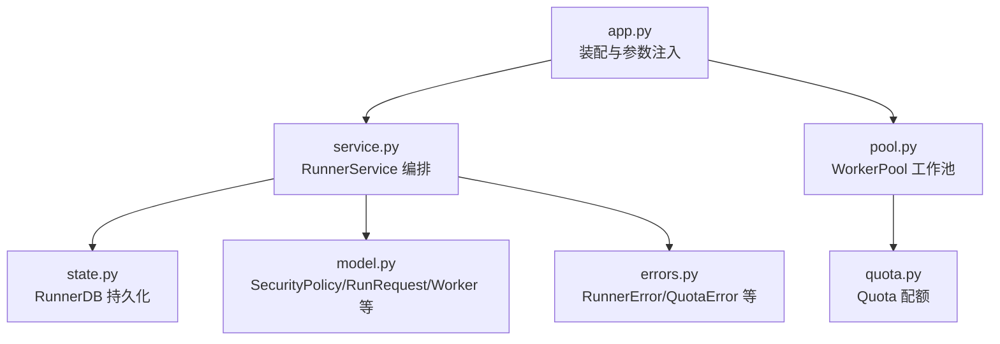
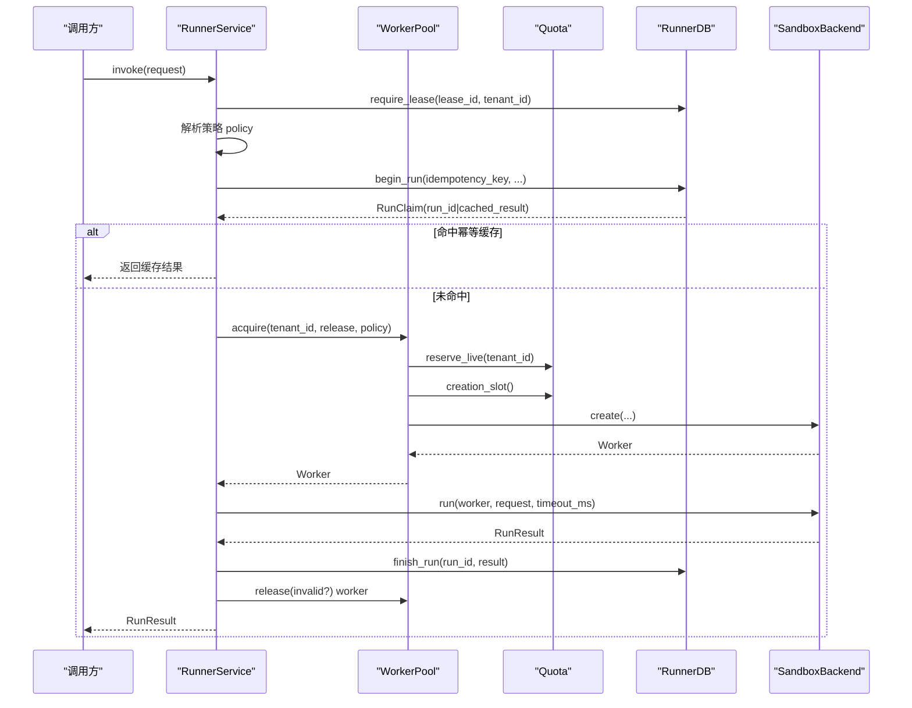
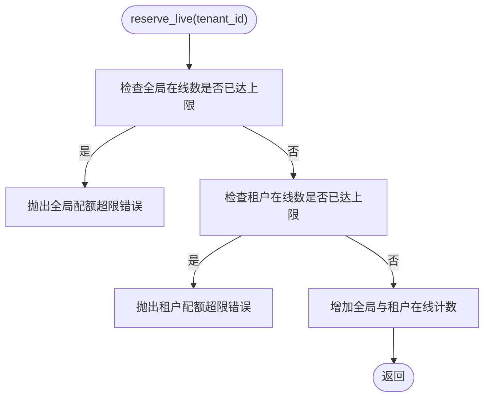
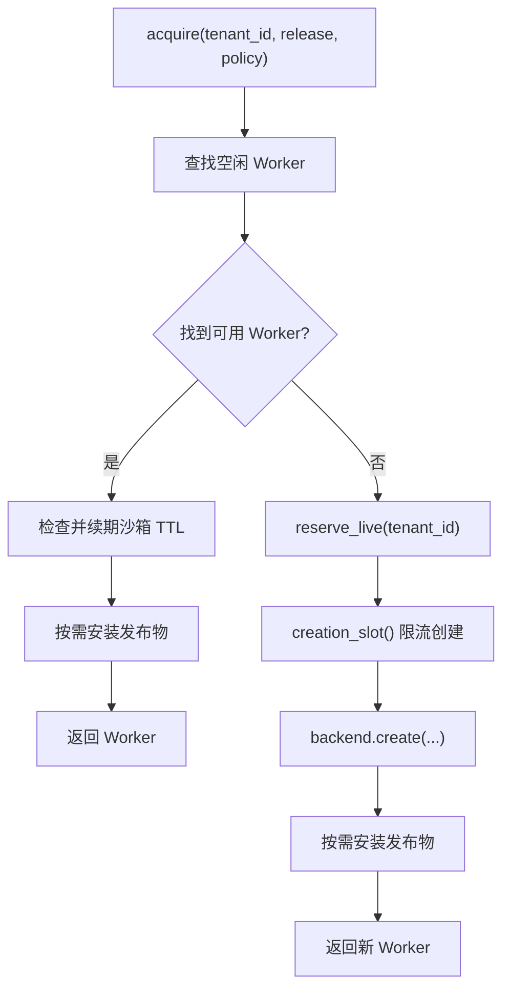
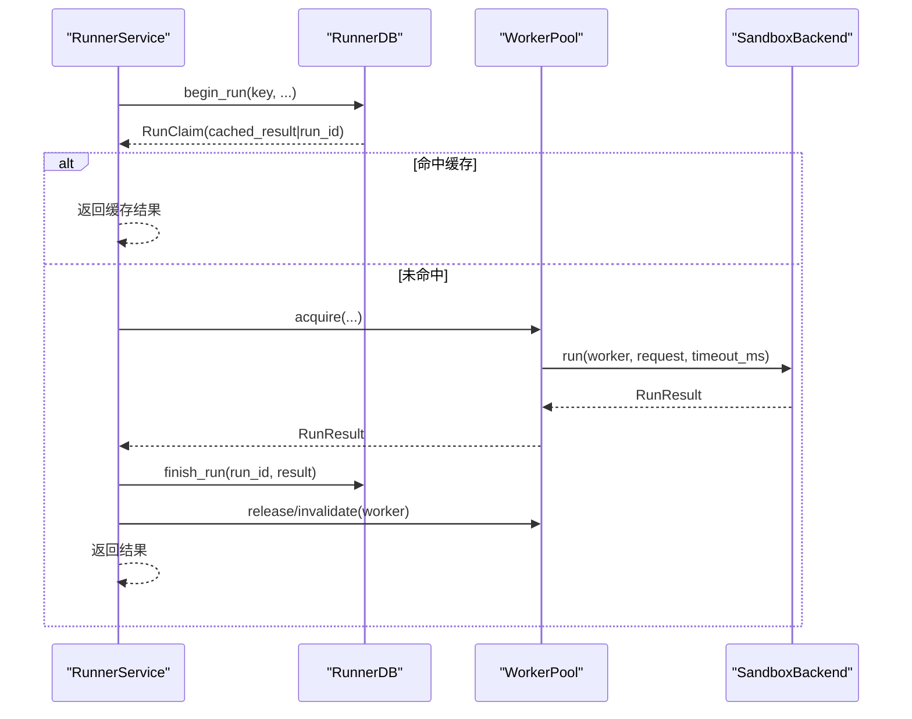
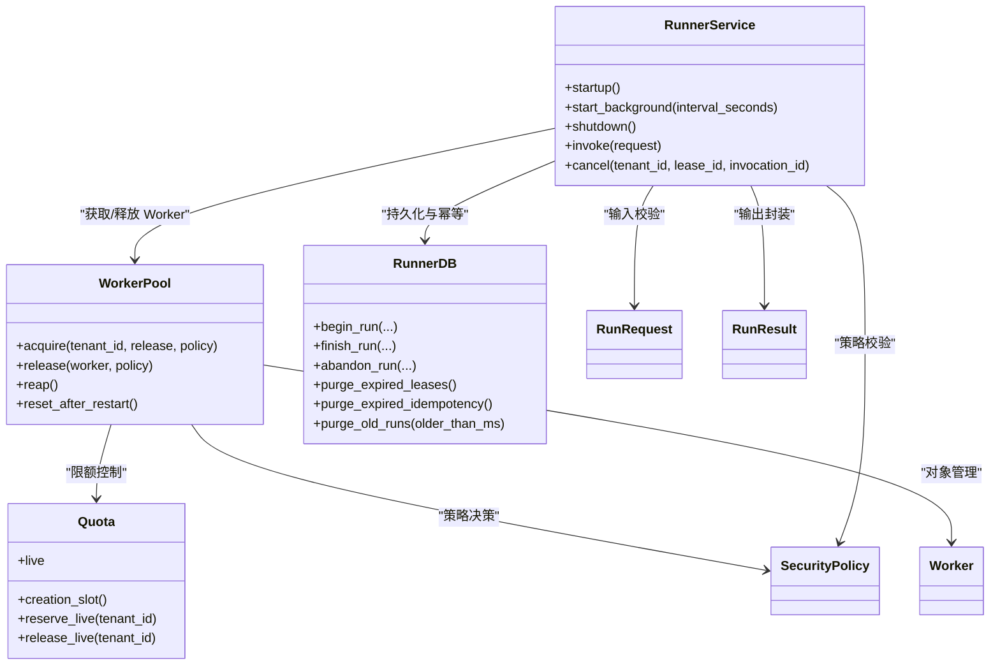

# 资源管理

<cite>
**本文引用的文件**   
- [runner_engine/quota.py](file://runner_engine/quota.py)
- [runner_engine/pool.py](file://runner_engine/pool.py)
- [runner_engine/service.py](file://runner_engine/service.py)
- [runner_engine/model.py](file://runner_engine/model.py)
- [runner_engine/state.py](file://runner_engine/state.py)
- [runner_engine/errors.py](file://runner_engine/errors.py)
- [runner_engine/app.py](file://runner_engine/app.py)
- [tests/test_quota.py](file://tests/test_quota.py)
- [tests/test_pool_destroy_idempotent.py](file://tests/test_pool_destroy_idempotent.py)
</cite>

## 目录
1. [引言](#引言)
2. [项目结构](#项目结构)
3. [核心组件](#核心组件)
4. [架构总览](#架构总览)
5. [详细组件分析](#详细组件分析)
6. [依赖关系分析](#依赖关系分析)
7. [性能与容量规划](#性能与容量规划)
8. [故障排查指南](#故障排查指南)
9. [结论](#结论)
10. [附录：配置与监控清单](#附录配置与监控清单)

## 引言
本文件围绕 runner_engine 的资源管理能力进行系统化说明，重点覆盖智能配额控制、工作池调度、并发控制、资源限制与动态调整、资源回收与内存管理策略，以及容量规划与优化实践。目标是帮助读者在不深入源码的情况下，也能理解系统如何安全、高效地分配和回收沙箱工作进程，并在多租户场景下避免资源竞争与死锁。

## 项目结构
与资源管理直接相关的代码集中在 runner_engine 子包中，关键文件如下：
- quota.py：配额模型与并发控制
- pool.py：工作池管理与资源调度
- service.py：编排层，协调租约、执行、结果持久化与工作池
- model.py：数据模型（策略、请求、结果、Worker 等）
- state.py：基于 PostgreSQL 的持久化状态（租约、运行记录、幂等缓存）
- errors.py：统一错误类型
- app.py：运行时装配与环境变量注入

图示来源
- [runner_engine/app.py:92-139](file://runner_engine/app.py#L92-L139)
- [runner_engine/service.py:80-115](file://runner_engine/service.py#L80-L115)
- [runner_engine/pool.py:11-46](file://runner_engine/pool.py#L11-L46)
- [runner_engine/quota.py:9-27](file://runner_engine/quota.py#L9-L27)
- [runner_engine/state.py:131-149](file://runner_engine/state.py#L131-L149)
- [runner_engine/model.py:26-35](file://runner_engine/model.py#L26-L35)
- [runner_engine/errors.py:1-22](file://runner_engine/errors.py#L1-L22)

章节来源
- [runner_engine/app.py:92-139](file://runner_engine/app.py#L92-L139)

## 核心组件
- Quota：负责全局并发创建数、全局在线沙箱数、单租户在线沙箱数的限额控制，并提供上下文管理器用于“创建槽位”限流。
- WorkerPool：按租户+运行时+安全策略维度维护空闲 Worker 列表，实现复用、过期清理、TTL 续期、安装发布物、销毁去重与配额释放。
- RunnerService：编排调用生命周期，校验输入、获取策略、申请租约、执行、持久化结果、回收或失效 Worker，并启动后台清理任务。
- RunnerDB：基于 PostgreSQL 的租约、运行记录与幂等缓存表的管理，提供事务性 claim/finish/abandon 操作与过期清理。
- SecurityPolicy：定义 CPU、内存、最大超时、网络白名单、是否允许复用沙箱等策略约束。
- Worker：表示一个可复用的沙箱工作进程，包含健康状态、最后使用时间、已安装发布物集合、过期时间等元信息。

章节来源
- [runner_engine/quota.py:9-61](file://runner_engine/quota.py#L9-L61)
- [runner_engine/pool.py:11-188](file://runner_engine/pool.py#L11-L188)
- [runner_engine/service.py:80-115](file://runner_engine/service.py#L80-L115)
- [runner_engine/state.py:131-149](file://runner_engine/state.py#L131-L149)
- [runner_engine/model.py:26-35](file://runner_engine/model.py#L26-L35)
- [runner_engine/model.py:73-90](file://runner_engine/model.py#L73-L90)

## 架构总览
资源管理的整体流程由 RunnerService 驱动，通过 WorkerPool 获取或创建 Worker，并通过 Quota 控制并发与在线数量；所有执行状态与幂等缓存落盘到 RunnerDB。

图示来源
- [runner_engine/service.py:188-405](file://runner_engine/service.py#L188-L405)
- [runner_engine/pool.py:73-130](file://runner_engine/pool.py#L73-L130)
- [runner_engine/quota.py:28-55](file://runner_engine/quota.py#L28-L55)
- [runner_engine/state.py:411-521](file://runner_engine/state.py#L411-L521)

## 详细组件分析

### 配额模型与并发控制（Quota）
- 设计要点
  - 三个维度的限额：
    - 全局同时创建上限 max_creating：通过有界信号量控制创建并发。
    - 全局在线沙箱上限 max_live：防止系统过载。
    - 单租户在线沙箱上限 max_live_per_tenant：防止单租户独占资源。
  - 原子性与一致性：使用互斥锁保护 _live 与 _tenant_live 计数，保证并发安全。
  - 上下文管理器 creation_slot：确保创建完成后释放“创建槽位”，但不影响“在线计数”。
- 行为特征
  - reserve_live：若达到全局或租户上限，抛出 QuotaError，标记为可重试。
  - release_live：在 Worker 销毁时释放在线计数，支持幂等释放（计数不会为负）。
  - live：只读属性，供监控与观测。

图示来源
- [runner_engine/quota.py:36-55](file://runner_engine/quota.py#L36-L55)

章节来源
- [runner_engine/quota.py:9-61](file://runner_engine/quota.py#L9-L61)
- [tests/test_quota.py:6-15](file://tests/test_quota.py#L6-L15)

### 工作池与资源调度（WorkerPool）
- 设计要点
  - 空闲池键：tenant_id + runtime.id + profile，确保不同租户、运行时与安全策略隔离。
  - 复用策略：优先从空闲池取 Worker，减少冷启动开销。
  - 过期与清理：
    - idle_seconds：超过空闲阈值则视为过期。
    - orphan_ttl_seconds：孤儿沙箱 TTL，配合后端续期机制。
    - renew_before_seconds：接近过期前触发续期，结合策略中的 max_timeout_ms 预留执行余量。
  - 发布物安装：按需 install，限制每个 Worker 最多安装的发布物数量 max_installed_releases。
  - 销毁与配额释放：destroy 去重，确保 quota.release_live 仅执行一次。
- 关键流程
  - acquire：先尝试复用，失败则 reserve_live + creation_slot + backend.create，异常时回滚配额。
  - release：根据策略决定是否放回空闲池，否则销毁。
  - reap：周期性清理空闲过期 Worker。
  - reset_after_restart：重启后清理遗留 Worker，并调用后端 cleanup_managed。

图示来源
- [runner_engine/pool.py:73-130](file://runner_engine/pool.py#L73-L130)

章节来源
- [runner_engine/pool.py:11-188](file://runner_engine/pool.py#L11-L188)
- [tests/test_pool_destroy_idempotent.py:19-39](file://tests/test_pool_destroy_idempotent.py#L19-L39)

### 编排与执行路径（RunnerService）
- 职责
  - 校验请求大小、幂等键、属性白名单与字节上限。
  - 获取并校验策略，裁剪超时不超过策略上限。
  - 通过 RunnerDB 进行幂等 claim，命中缓存直接返回。
  - 通过 WorkerPool 获取 Worker，执行后端 run，持久化结果。
  - 根据结果决定 release 或 invalidate Worker。
  - 启动后台线程定期清理过期租约、幂等缓存与旧运行记录。
- 并发控制
  - 使用 ActiveRun 字典与 RLock 防止同一 invocation_id 并发执行。
  - 对 cancel 做租户与租约校验，避免越权取消。

图示来源
- [runner_engine/service.py:188-405](file://runner_engine/service.py#L188-L405)
- [runner_engine/state.py:411-521](file://runner_engine/state.py#L411-L521)

章节来源
- [runner_engine/service.py:80-115](file://runner_engine/service.py#L80-L115)
- [runner_engine/service.py:188-405](file://runner_engine/service.py#L188-L405)

### 数据模型与策略（SecurityPolicy、Worker、RunRequest）
- SecurityPolicy
  - 定义 CPU、内存、最大超时、网络白名单、是否允许复用沙箱等。
  - 被 RunnerService 用于限制请求超时与 Worker 复用策略。
- Worker
  - 包含健康状态、最后使用时间、已安装发布物集合、沙箱过期时间等。
  - 被 WorkerPool 用于判断是否过期、是否需要续期、是否可复用。
- RunRequest/RunResult
  - 封装执行输入输出，RunnerService 对其内容进行大小与属性校验。

章节来源
- [runner_engine/model.py:26-35](file://runner_engine/model.py#L26-L35)
- [runner_engine/model.py:47-90](file://runner_engine/model.py#L47-L90)
- [runner_engine/service.py:215-235](file://runner_engine/service.py#L215-L235)

### 持久化与幂等（RunnerDB）
- 表结构
  - runner.leases：租约表，含租户、项目、处理器、发布物、过期时间。
  - runner.runs：执行历史与审计，含状态、结果、时长、worker_id 等。
  - runner.idempotency_keys：幂等缓存，支持可重放与过期清理。
- 关键操作
  - begin_run：FOR UPDATE 锁定幂等键，处理 RUNNING/DONE 分支，插入 runs 记录。
  - finish_run：更新 runs 与 idempotency_keys，非幂等结果不写入缓存。
  - abandon_run：将 RUNNING 转为 ABANDONED，清理幂等缓存。
  - purge_expired_leases/idempotency/runs：后台清理。

章节来源
- [runner_engine/state.py:16-82](file://runner_engine/state.py#L16-L82)
- [runner_engine/state.py:411-607](file://runner_engine/state.py#L411-L607)
- [runner_engine/state.py:650-684](file://runner_engine/state.py#L650-L684)

## 依赖关系分析
- 耦合关系
  - RunnerService 依赖 Catalog、RunnerDB、WorkerPool、策略映射。
  - WorkerPool 依赖 SandboxBackend 与 Quota。
  - Quota 依赖 threading 原语与自定义 QuotaError。
  - RunnerDB 依赖 psycopg/psycopg_pool 与自定义 LeaseError/RunnerError。
- 外部依赖
  - PostgreSQL：存储租约、运行记录与幂等缓存。
  - 环境变量：在 app.py 中注入配额与工作池参数。

图示来源
- [runner_engine/service.py:80-115](file://runner_engine/service.py#L80-L115)
- [runner_engine/pool.py:11-46](file://runner_engine/pool.py#L11-L46)
- [runner_engine/quota.py:9-27](file://runner_engine/quota.py#L9-L27)
- [runner_engine/state.py:131-149](file://runner_engine/state.py#L131-L149)
- [runner_engine/model.py:26-35](file://runner_engine/model.py#L26-L35)
- [runner_engine/model.py:73-90](file://runner_engine/model.py#L73-L90)

章节来源
- [runner_engine/service.py:80-115](file://runner_engine/service.py#L80-L115)
- [runner_engine/pool.py:11-46](file://runner_engine/pool.py#L11-L46)
- [runner_engine/quota.py:9-27](file://runner_engine/quota.py#L9-L27)
- [runner_engine/state.py:131-149](file://runner_engine/state.py#L131-L149)

## 性能与容量规划
- 并发与吞吐
  - max_creating：控制创建并发，建议根据后端创建成本与数据库连接池大小调优。
  - max_live：控制全局在线沙箱数，需结合 CPU/内存总量与单实例资源占用估算。
  - max_live_per_tenant：防止单租户抢占，建议按租户等级设置差异化上限。
- 复用与延迟
  - idle_seconds：增大可减少冷启动，但会延长内存占用；过小会导致频繁重建。
  - renew_before_seconds：提前续期可降低执行中断风险，需结合 max_timeout_ms 与网络抖动。
  - max_installed_releases：限制每个 Worker 的安装数量，避免内存膨胀与初始化开销。
- 清理与回收
  - background reaper：定期清理空闲 Worker、过期租约、幂等缓存与旧运行记录。
  - reset_after_restart：服务重启后清理遗留 Worker，避免僵尸进程。
- 容量规划建议
  - 以峰值 QPS × 平均执行时长估算在线 Worker 需求，再乘以安全系数。
  - 根据租户分布设定 per-tenant 上限，避免热点租户导致雪崩。
  - 结合数据库连接池大小与 PG 负载，合理设置 min_pool_size/max_pool_size。
  - 针对长尾任务，适当提高 renew_before_seconds 与 max_timeout_ms，降低续期失败率。

[本节为通用指导，不直接分析具体文件]

## 故障排查指南
- 常见错误与定位
  - 全局/租户配额超限：QuotaError，检查 max_live 与 max_live_per_tenant 是否过低，或是否存在泄漏未 release。
  - 租约未知/过期/越权：LeaseError，检查租约生命周期与租户隔离逻辑。
  - 运行状态丢失/幂等状态丢失：RunnerError，检查 finish_run 的原子性与并发访问。
  - 取消失败：CANCEL_FAILED，检查后端 cancel 传输与 Worker 健康状态。
- 排查步骤
  - 观察 live 计数与后台清理日志，确认是否有 Worker 未被正确释放。
  - 检查 RunnerDB 中 runs 与 idempotency_keys 的状态，确认是否存在 RUNNING 滞留。
  - 核对策略配置，确认超时与复用策略是否符合业务预期。
  - 验证环境变量注入是否正确，尤其是 RUNNER_MAX_* 与 RUNNER_WORKER_* 系列参数。

章节来源
- [runner_engine/errors.py:1-22](file://runner_engine/errors.py#L1-L22)
- [runner_engine/service.py:364-405](file://runner_engine/service.py#L364-L405)
- [runner_engine/state.py:313-346](file://runner_engine/state.py#L313-L346)
- [runner_engine/state.py:523-607](file://runner_engine/state.py#L523-L607)

## 结论
runner_engine 的资源管理以 Quota 为核心，结合 WorkerPool 的工作池调度与 RunnerService 的编排能力，实现了多租户、可复用、可观测且具备幂等保障的沙箱执行环境。通过合理的策略配置与容量规划，可在高并发场景下保持稳定的吞吐与低延迟，同时有效避免资源竞争与死锁。

[本节为总结性内容，不直接分析具体文件]

## 附录：配置与监控清单
- 关键环境变量（由 app.py 注入）
  - RUNNER_MAX_CREATING：最大同时创建数
  - RUNNER_MAX_LIVE：最大在线沙箱数
  - RUNNER_MAX_LIVE_PER_TENANT：单租户最大在线沙箱数
  - RUNNER_WORKER_IDLE_SECONDS：空闲超时
  - RUNNER_SANDBOX_ORPHAN_TTL_SECONDS：孤儿沙箱 TTL
  - RUNNER_SANDBOX_RENEW_BEFORE_SECONDS：提前续期阈值
  - RUNNER_MAX_RELEASES_PER_SANDBOX：每沙箱最大安装发布物数
  - RUNNER_LEASE_TTL_MS：租约 TTL
- 监控指标建议
  - Quota.live：当前在线沙箱数
  - WorkerPool.reap 清理计数
  - RunnerDB.purge_expired_* 清理计数
  - 执行成功率、超时率、取消率、错误码分布
- 最佳实践
  - 将 max_live 与 max_live_per_tenant 与业务峰值与租户分布匹配。
  - 合理设置 idle_seconds 与 renew_before_seconds，平衡复用与稳定性。
  - 启用后台清理任务，定期清理过期租约与幂等缓存。
  - 对不可复用错误（如用户异常、导入错误）允许复用，提升吞吐。

章节来源
- [runner_engine/app.py:92-139](file://runner_engine/app.py#L92-L139)
- [runner_engine/service.py:117-138](file://runner_engine/service.py#L117-L138)
- [runner_engine/pool.py:161-187](file://runner_engine/pool.py#L161-L187)