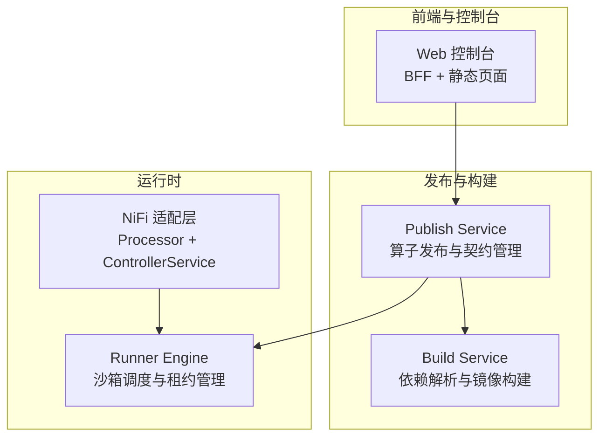
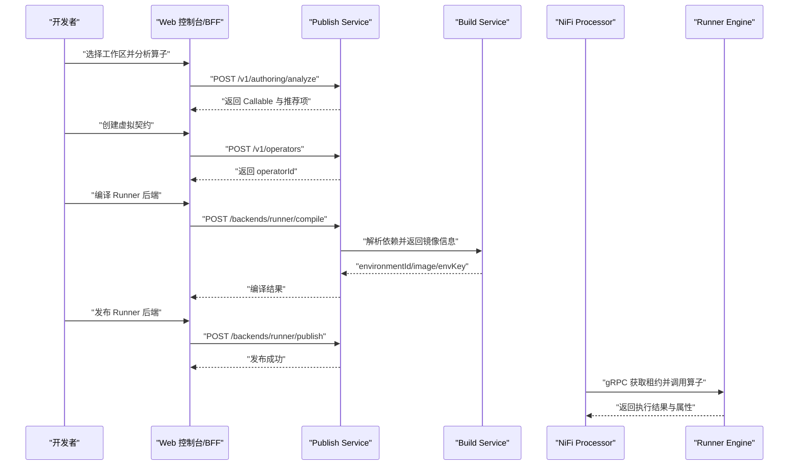
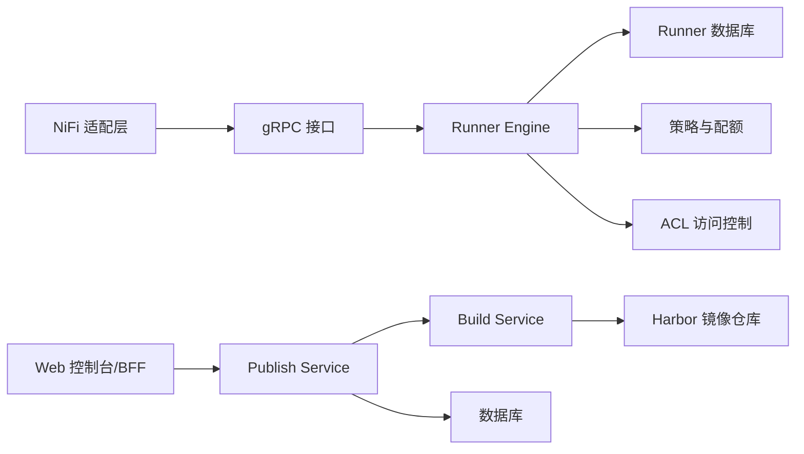

# 项目介绍

<cite>
**本文引用的文件**   
- [pyproject.toml](file://pyproject.toml)
- [runner_engine/app.py](file://runner_engine/app.py)
- [publish_service/app.py](file://publish_service/app.py)
- [build_service/app.py](file://build_service/app.py)
- [nifi/README.md](file://nifi/README.md)
- [web/README.md](file://web/README.md)
- [runner_engine/service.py](file://runner_engine/service.py)
- [tests/test_service_security.py](file://tests/test_service_security.py)
</cite>

## 目录
1. [引言](#引言)
2. [项目结构](#项目结构)
3. [核心组件](#核心组件)
4. [架构总览](#架构总览)
5. [关键流程与交互](#关键流程与交互)
6. [设计理念](#设计理念)
7. [目标用户与使用场景](#目标用户与使用场景)
8. [发展历程与未来规划](#发展历程与未来规划)
9. [依赖关系分析](#依赖关系分析)
10. [性能与安全特性](#性能与安全特性)
11. [常见问题与排错建议](#常见问题与排错建议)
12. [结语](#结语)

## 引言
Runner Engine 是一个面向 NiFi 的托管 Python 算子构建、发布与运行平台。它的核心使命是：为 Python 算子在 NiFi 中的全生命周期提供统一支撑，覆盖从源码分析、契约定义、编译打包、镜像构建、版本发布，到在隔离沙箱中安全执行、资源配额控制、租约管理与可观测性。

该项目解决的主要痛点包括：
- Python 算子在 NiFi 环境中缺乏统一的构建与发布流水线；
- 运行时环境不可控、依赖冲突难以治理；
- 算子执行缺少租户隔离、权限控制与资源配额；
- NiFi 侧与 Python 运行时之间缺乏稳定、安全的通信与幂等保障；
- 运维侧缺少对算子版本、部署状态和运行状态的统一可视化管理。

通过微服务化与插件化设计，Runner Engine 将“构建”“发布”“运行”“编排集成”解耦，既支持以 Runner 方式运行 Python 算子，也支持与 NiFi Native 扩展协同，从而兼顾灵活性与生产可用性。

**章节来源**
- [pyproject.toml:5-18](file://pyproject.toml#L5-L18)

## 项目结构
仓库采用多服务、多模块的组织方式，核心目录职责如下：
- `runner_engine`：Runner 运行时服务，负责算子实例的生命周期管理、沙箱调度、租约与幂等、策略与配额控制、gRPC 接入与管理端点。
- `publish_service`：算子发布服务，负责源码分析、虚拟契约创建、后端编译（Runner/NiFi Native）、发布产物管理、边缘环境与依赖冲突处理。
- `build_service`：构建服务，负责根据 Python 依赖解析并生成可复用的运行时镜像，对接 Harbor 等镜像仓库。
- `operator_authoring`：算子作者工具链，包含 AST 扫描、适配器生成、执行计划与模型定义。
- `nifi`：NiFi 适配层，提供 Processor 与 Controller Service，实现 gRPC 调用、租约续期、幂等键与属性边界控制。
- `web`：控制台与 BFF，提供算子编写、契约配置、编译发布、观察与运维界面。
- `proto`：Runner 与 NiFi 之间的 gRPC 协议定义。
- `images`：Runner 与 Runtime 的 Docker 镜像定义。
- `config`：ACL、策略、OpenSandbox 集群配置示例。
- `integration`、`tests`：集成测试与单元测试。

**图表来源**
- [web/README.md:66-82](file://web/README.md#L66-L82)
- [publish_service/app.py:151-170](file://publish_service/app.py#L151-L170)
- [build_service/app.py:122-138](file://build_service/app.py#L122-L138)
- [runner_engine/app.py:26-74](file://runner_engine/app.py#L26-L74)
- [nifi/README.md:3-13](file://nifi/README.md#L3-L13)

**章节来源**
- [web/README.md:66-82](file://web/README.md#L66-L82)
- [publish_service/app.py:151-170](file://publish_service/app.py#L151-L170)
- [build_service/app.py:122-138](file://build_service/app.py#L122-L138)
- [runner_engine/app.py:26-74](file://runner_engine/app.py#L26-L74)
- [nifi/README.md:3-13](file://nifi/README.md#L3-L13)

## 核心组件
- **Runner Engine**：对外暴露 gRPC 接口，对内维护 WorkerPool、沙箱后端、策略与配额、租约与幂等记录、Catalog 与数据库状态。启动时加载 ACL、策略、集群配置，并可选开启 Admin HTTP 管理端点。
- **Publish Service**：基于 FastAPI 提供算子分析、虚拟契约创建、后端编译与发布、边缘部署查询与下载、MinIO 文件夹下载等能力。健康检查暴露后端类型、是否启用运行时生命周期等信息。
- **Build Service**：提供运行时环境解析、查询与重试接口，对接 Harbor 进行镜像拉取与复用，输出结构化环境信息供 Publish Service 使用。
- **NiFi 适配层**：仅暴露两个公共入口：Processor 与共享 Controller Service，负责租约获取与续期、gRPC 调用、幂等键计算与属性白名单过滤。
- **Web 控制台与 BFF**：提供五步式算子编写体验，连接 Publish Service，不直接访问 Runner 或 Build Service，保证职责边界清晰。

**章节来源**
- [runner_engine/app.py:26-227](file://runner_engine/app.py#L26-L227)
- [publish_service/app.py:151-346](file://publish_service/app.py#L151-L346)
- [build_service/app.py:122-181](file://build_service/app.py#L122-L181)
- [nifi/README.md:3-13](file://nifi/README.md#L3-L13)
- [web/README.md:66-82](file://web/README.md#L66-L82)

## 架构总览
Runner Engine 的整体架构围绕“算子生命周期”展开，分为四个阶段：
1. **分析与契约**：Web 控制台调用 Publish Service 分析源码，选择 Callable，生成虚拟契约。
2. **编译与发布**：Publish Service 根据后端类型（Runner/NiFi Native）编译契约，Runner 路径会触发 Build Service 解析依赖并返回镜像信息；NiFi Native 路径生成包并标记需要额外部署。
3. **运行与调度**：NiFi Processor 通过 gRPC 与 Runner 交互，Runner 在沙箱中执行算子，管理租约、幂等、属性边界与资源配额。
4. **可观测与运维**：Admin HTTP、观察控制台、边缘部署查询与下载共同构成运维视图。

**图表来源**
- [web/README.md:188-347](file://web/README.md#L188-L347)
- [publish_service/app.py:201-277](file://publish_service/app.py#L201-L277)
- [build_service/app.py:140-179](file://build_service/app.py#L140-L179)
- [nifi/README.md:15-34](file://nifi/README.md#L15-L34)

## 关键流程与交互
### 算子分析与契约创建
- Web 控制台通过 `/v1/authoring/analyze` 分析工作区，自动推荐 Python Root 与 Callable。
- 用户确认后调用 `/v1/operators` 创建虚拟契约，Publish Service 会重新扫描、校验 sourceRevision，保存不可变快照并生成算子 ID。

### 编译与发布
- Runner 后端编译时会生成 variant，并根据 profile 决定编译选项；发布时若依赖未就绪，会调用 Build Service 解析依赖并返回镜像信息。
- NiFi Native 后端编译后生成 artifact，发布响应中包含 `deploymentRequired=true`，表示仍需手动部署到 NiFi Python extension 目录。

### 运行与租约
- NiFi Processor 在调度时获取租约，并在每次调用前确保租约有效；Runner 在租约过期或未知时重新获取。
- 幂等键由 processor-id、release-id 与 FlowFile uuid 组合生成，保证 NiFi 重试下的稳定性。
- 属性边界通过白名单控制，Runner 侧再次过滤返回属性，防止敏感信息泄露。

**章节来源**
- [web/README.md:188-347](file://web/README.md#L188-L347)
- [publish_service/app.py:201-277](file://publish_service/app.py#L201-L277)
- [nifi/README.md:15-34](file://nifi/README.md#L15-L34)

## 设计理念
- **微服务架构**：Runner、Publish、Build 各自独立部署，通过 HTTP/gRPC 协作，便于水平扩展与故障隔离。
- **插件化后端**：Publish Service 支持 runner 与 nifi_native 两种后端，未来可扩展更多执行目标。
- **安全隔离**：Runner 使用 OpenSandbox 作为沙箱后端，结合 ACL、策略与配额限制，避免跨租户越权与资源滥用。
- **契约驱动**：以虚拟契约为核心，将源码、参数绑定、输出编码与运行策略解耦，提升可测试性与可演进性。
- **可观测与可运维**：Admin HTTP、观察控制台、边缘部署查询与下载共同提供生产级运维能力。

**章节来源**
- [runner_engine/app.py:87-154](file://runner_engine/app.py#L87-L154)
- [publish_service/app.py:157-170](file://publish_service/app.py#L157-L170)
- [web/README.md:66-82](file://web/README.md#L66-L82)

## 目标用户与使用场景
- **NiFi 开发者**：使用 Web 控制台编写 Python 算子，完成分析、契约配置、编译与发布，无需关心底层沙箱与依赖构建细节。
- **数据工程师**：在 NiFi 流程中嵌入 Python 算子，享受幂等、租约、属性边界与可观测性保障。
- **运维人员**：通过 Admin HTTP、观察控制台与边缘部署查询，监控算子版本、镜像状态、依赖冲突与运行实例。
- **典型场景**：
  - 实时数据清洗与特征工程；
  - 风控规则计算与外部 API 调用；
  - 多租户环境下按策略隔离执行；
  - 与 NiFi Native 扩展协同，满足特定平台需求。

**章节来源**
- [web/README.md:8-28](file://web/README.md#L8-L28)
- [nifi/README.md:15-34](file://nifi/README.md#L15-L34)

## 发展历程与未来规划
- **当前版本**：Runner Engine 与相关服务均标注为 3.3.0，表明已进入较成熟的迭代阶段。
- **已实现能力**：
  - 算子分析与虚拟契约；
  - Runner 与 NiFi Native 双后端；
  - 依赖解析与镜像构建；
  - 租约、幂等、属性边界与配额；
  - Web 控制台与 BFF；
  - 边缘部署查询与下载。
- **未来方向**：
  - 扩展更多后端与执行目标；
  - 增强多租户与 RBAC 能力；
  - 完善发布历史、Job 轮询与自动部署；
  - 提供更丰富的观察指标与诊断工具。

**章节来源**
- [pyproject.toml:5-18](file://pyproject.toml#L5-L18)
- [web/README.md:416-435](file://web/README.md#L416-L435)

## 依赖关系分析
Runner Engine 的核心依赖与服务间关系如下：
- Runner Engine 依赖 Catalog、策略、配额、沙箱后端、数据库与 ACL。
- Publish Service 依赖 Workspace、Catalog、Source Store、Edge 部署存储与 Build Service。
- Build Service 依赖数据库与 Harbor 客户端。
- NiFi 适配层依赖 gRPC 与 Runner 提供的租约与调用接口。

**图表来源**
- [runner_engine/app.py:87-154](file://runner_engine/app.py#L87-L154)
- [publish_service/app.py:50-128](file://publish_service/app.py#L50-L128)
- [build_service/app.py:65-99](file://build_service/app.py#L65-L99)
- [nifi/README.md:3-13](file://nifi/README.md#L3-L13)

**章节来源**
- [runner_engine/app.py:87-154](file://runner_engine/app.py#L87-L154)
- [publish_service/app.py:50-128](file://publish_service/app.py#L50-L128)
- [build_service/app.py:65-99](file://build_service/app.py#L65-L99)
- [nifi/README.md:3-13](file://nifi/README.md#L3-L13)

## 性能与安全特性
- **性能**：
  - WorkerPool 与沙箱后端支持并发调度与空闲回收；
  - 租约机制减少无效调用与重复计算；
  - 幂等键避免 NiFi 重试导致的副作用。
- **安全**：
  - ACL 与策略控制释放的 profile 合法性；
  - 属性白名单与 Runner 侧二次过滤防止敏感数据泄露；
  - 跨租约取消被拒绝，避免越权操作；
  - Admin HTTP 默认仅本地监听，需显式配置 token 才启用。

**章节来源**
- [runner_engine/service.py:140-186](file://runner_engine/service.py#L140-L186)
- [tests/test_service_security.py:65-84](file://tests/test_service_security.py#L65-L84)
- [runner_engine/app.py:174-210](file://runner_engine/app.py#L174-L210)

## 常见问题与排错建议
- **Web 控制台无法连接 Publish Service**：确认 `MPR_PUBLISH_SERVICE_URL` 指向正确的服务地址，且服务 `/health` 可访问。
- **Runner 未启用 Admin HTTP**：检查是否配置了 `RUNNER_ADMIN_TOKEN`，否则生命周期管理 HTTP 会被禁用。
- **NiFi Native 发布后仍提示需要部署**：这是预期行为，`deploymentRequired=true` 表示还需将产物部署到 NiFi Python extension 目录。
- **依赖解析失败或镜像缺失**：查看 Build Service 返回的 environment 状态与错误信息，必要时重试解析。
- **属性被过滤或丢失**：确认 NiFi 侧 Input Attribute Allow-list 与 Runner 侧 release 发布的 allow-list 一致。

**章节来源**
- [web/README.md:122-133](file://web/README.md#L122-L133)
- [runner_engine/app.py:174-210](file://runner_engine/app.py#L174-L210)
- [web/README.md:339-347](file://web/README.md#L339-L347)
- [build_service/app.py:140-179](file://build_service/app.py#L140-L179)
- [nifi/README.md:31-34](file://nifi/README.md#L31-L34)

## 结语
Runner Engine 为 NiFi 中的 Python 算子提供了从开发到运行的完整闭环。它以微服务与插件化为基础，结合契约驱动、安全隔离与可观测性，帮助团队在复杂数据流场景中高效交付可靠的 Python 算子。对于初学者而言，可以从 Web 控制台入手，逐步理解分析、契约、编译、发布与运行的全流程；对于资深用户，则可深入 Runner、Publish、Build 的内部实现，定制策略、配额与后端扩展。