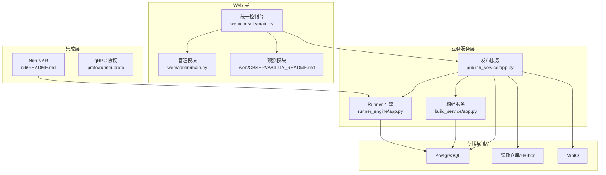
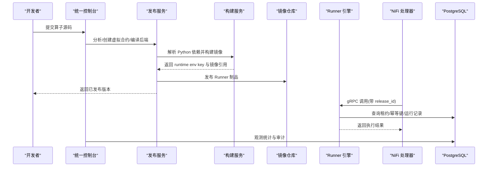
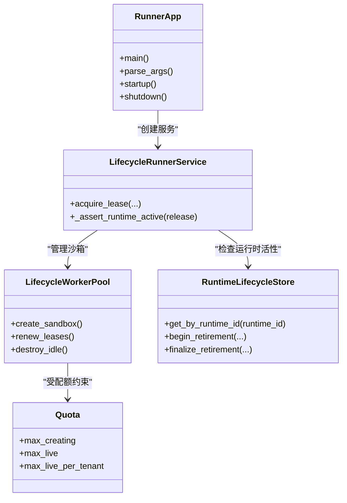
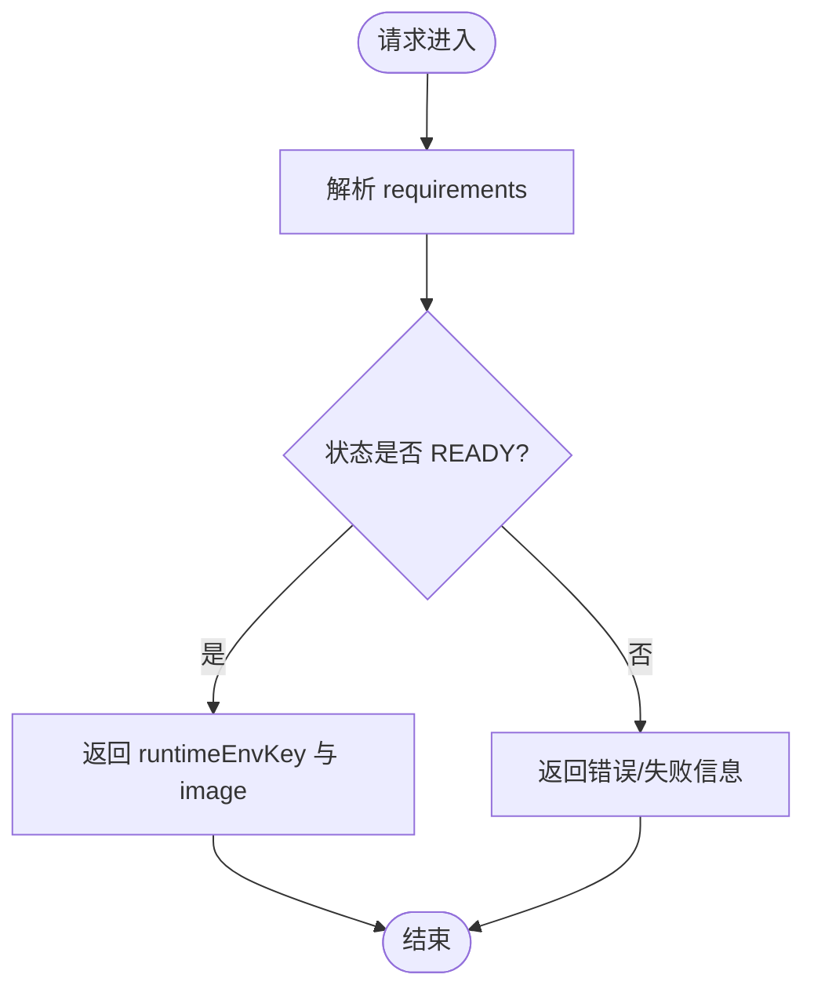
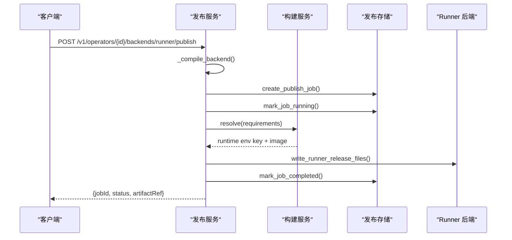
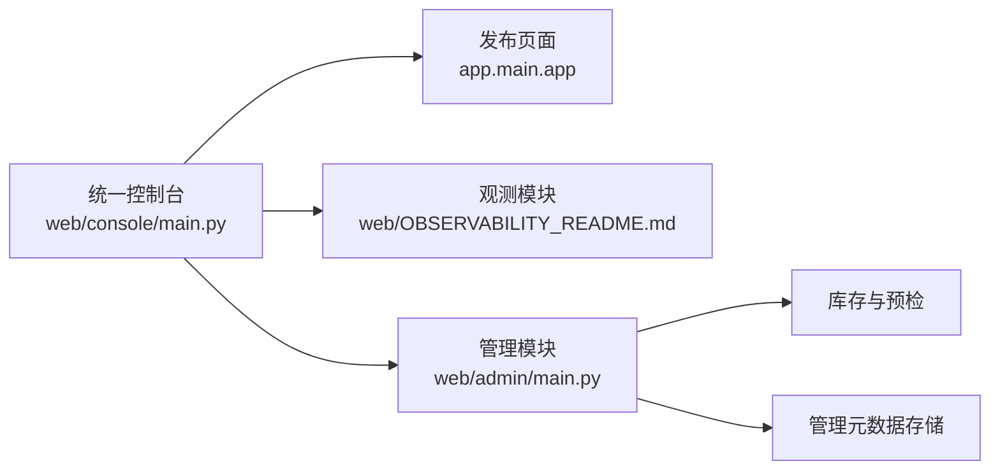
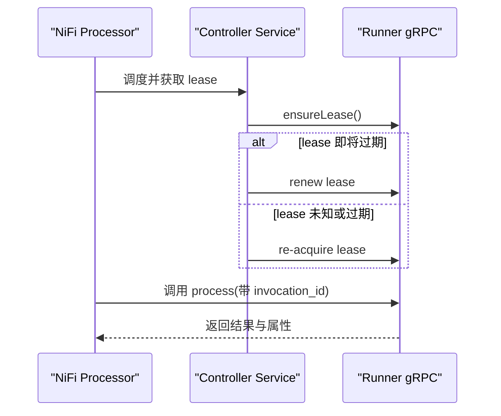
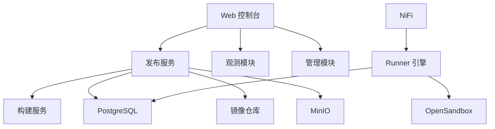

# 项目概述

<cite>
**本文引用的文件**   
- [pyproject.toml](file://pyproject.toml)
- [runner_engine/app.py](file://runner_engine/app.py)
- [build_service/app.py](file://build_service/app.py)
- [publish_service/app.py](file://publish_service/app.py)
- [publish_service/lifecycle_service.py](file://publish_service/lifecycle_service.py)
- [publish_service/runtime_lifecycle.py](file://publish_service/runtime_lifecycle.py)
- [runner_engine/lifecycle_service.py](file://runner_engine/lifecycle_service.py)
- [nifi/README.md](file://nifi/README.md)
- [web/UNIFIED_CONSOLE_README.md](file://web/UNIFIED_CONSOLE_README.md)
- [web/OBSERVABILITY_README.md](file://web/OBSERVABILITY_README.md)
- [web/console/main.py](file://web/console/main.py)
- [web/admin/main.py](file://web/admin/main.py)
</cite>

## 目录
1. [引言](#引言)
2. [项目结构](#项目结构)
3. [核心组件](#核心组件)
4. [架构总览](#架构总览)
5. [详细组件分析](#详细组件分析)
6. [依赖关系分析](#依赖关系分析)
7. [性能与容量特性](#性能与容量特性)
8. [快速开始指南](#快速开始指南)
9. [故障排查](#故障排查)
10. [结论](#结论)

## 引言
Runner Engine 是一个面向 NiFi 的托管 Python 算子平台，目标是让开发者以 Python 编写算子后，通过统一的构建、发布和运行流程，安全地部署到 NiFi 数据流中。系统提供：
- 算子生命周期管理：从源码分析、虚拟合约、后端编译到发布版本归档。
- 多后端支持：同时支持 Runner 运行时后端与 NiFi Native 后端。
- 环境隔离：基于 OpenSandbox 等沙箱实现租户级资源隔离与配额控制。
- 资源管理：对创建中的沙箱、在线沙箱数量、每租户并发进行限制。
- 自动化构建发布：根据 Python 依赖解析镜像，调用 Harbor 或镜像仓库完成制品产出。
- NiFi 集成：通过 Java NAR 暴露 Processor 与 gRPC Controller Service，将 NiFi FlowFile 调度到 Runner。

技术栈选择遵循现代 Python 微服务实践：
- Python 3.11+ 作为统一语言基线。
- FastAPI + Uvicorn 提供 HTTP API。
- gRPC 用于 NiFi 与 Runner 之间的高性能、双向可观测调用。
- PostgreSQL 承载构建、发布、Runner 状态与观测元数据。
- Docker 与镜像仓库（如 Harbor）承载运行时镜像与发布制品。
- Web 控制台提供免登录的统一入口，聚合发布、观测与管理能力。

**章节来源**
- [pyproject.toml:5-28](file://pyproject.toml#L5-L28)
- [web/UNIFIED_CONSOLE_README.md:1-12](file://web/UNIFIED_CONSOLE_README.md#L1-L12)

## 项目结构
仓库采用“按服务与职责划分”的结构：
- `runner_engine`：Runner 运行时服务，负责租约、幂等执行、沙箱池、策略与配额。
- `build_service`：构建服务，负责 Python 环境解析、镜像构建与环境状态管理。
- `publish_service`：发布服务，负责算子分析、虚拟合约、后端编译与发布。
- `operator_authoring`：算子作者工具，包含 AST 扫描、模型、快照与编译器。
- `nifi`：NiFi Java NAR，提供 ManagedPythonTransform 与 gRPC 运行时控制器。
- `web`：Web 控制台，包含原发布页面、独立观测模块、统一控制台与管理模块。
- `proto`：gRPC 协议定义。
- `config`：ACL、策略与 OpenSandbox 集群配置示例。
- `sql`：发布数据库 DDL。
- `tests`：单元测试与端到端测试。

**图表来源**
- [web/console/main.py:1-115](file://web/console/main.py#L1-L115)
- [web/admin/main.py:1-69](file://web/admin/main.py#L1-L69)
- [publish_service/app.py:135-170](file://publish_service/app.py#L135-L170)
- [build_service/app.py:106-140](file://build_service/app.py#L106-L140)
- [runner_engine/app.py:26-103](file://runner_engine/app.py#L26-L103)
- [nifi/README.md:1-13](file://nifi/README.md#L1-L13)

**章节来源**
- [web/UNIFIED_CONSOLE_README.md:65-72](file://web/UNIFIED_CONSOLE_README.md#L65-L72)
- [web/OBSERVABILITY_README.md:1-25](file://web/OBSERVABILITY_README.md#L1-L25)
- [pyproject.toml:23-32](file://pyproject.toml#L23-L32)

## 核心组件
- Runner Engine：对外暴露 gRPC 接口，接收 NiFi 调度请求，维护租约、幂等键、执行记录，并通过 WorkerPool 管理沙箱生命周期。
- Build Service：根据 Python requirements 解析并构建镜像，返回 runtime environment key 与镜像引用。
- Publish Service：接收算子源码，分析依赖、生成虚拟合约、编译后端契约，并将 Runner 产物发布到 Catalog 或原生包。
- Web 控制台：统一入口 `/`、`/observe/`、`/admin/`、`/console/`，分别承载发布、观测、管理与导航。
- NiFi 集成：ManagedPythonTransform 处理器与 GrpcManagedPythonRuntimeService 控制器服务，负责 FlowFile 属性过滤、幂等键生成与租约续期。

关键设计原则：
- 生命周期显式化：构建、发布、运行、退役均有明确状态与事务边界。
- 最小权限与只读观测：观测模块仅读取 PostgreSQL Schema，不写业务数据。
- 安全边界清晰：ACL、mTLS、Origin 校验、Content-Type 校验、最小网络暴露。
- 可观测性优先：通过 PostgreSQL Schema 与 OpenSandbox 指标采集提供运行态可见性。

**章节来源**
- [runner_engine/app.py:26-154](file://runner_engine/app.py#L26-L154)
- [build_service/app.py:65-99](file://build_service/app.py#L65-L99)
- [publish_service/app.py:50-128](file://publish_service/app.py#L50-L128)
- [web/console/main.py:1-115](file://web/console/main.py#L1-L115)
- [nifi/README.md:15-35](file://nifi/README.md#L15-L35)

## 架构总览
Runner Engine 的整体架构围绕“算子构建—发布—运行—观测—管理”展开：

**图表来源**
- [publish_service/app.py:201-277](file://publish_service/app.py#L201-L277)
- [build_service/app.py:140-180](file://build_service/app.py#L140-L180)
- [runner_engine/app.py:212-220](file://runner_engine/app.py#L212-L220)
- [nifi/README.md:15-29](file://nifi/README.md#L15-L29)

## 详细组件分析

### Runner Engine
Runner Engine 是 NiFi 调度的目标运行时，承担以下职责：
- 启动参数与配置：监听地址、Catalog 路径、数据库 URL、策略、ACL、OpenSandbox 集群、TLS 证书与客户端 CA。
- 生命周期存储：使用 RuntimeLifecycleStore 管理运行时退役状态。
- 沙箱池：LifecycleWorkerPool 管理沙箱创建、存活、回收与释放。
- 配额与策略：Quota 限制最大创建数、在线数与每租户并发；Policy 加载策略文件。
- 服务封装：LifecycleRunnerService 在基础 RunnerService 上增加运行时活性检查，阻止 RETIRING/RETIRED 的新租约与调用。
- 管理 HTTP：可选的 RunnerAdminHTTP 提供生命周期管理接口。
- gRPC 服务：serve 暴露 gRPC 接口，结合 AccessControl 做访问控制。

**图表来源**
- [runner_engine/app.py:26-154](file://runner_engine/app.py#L26-L154)
- [runner_engine/lifecycle_service.py:7-44](file://runner_engine/lifecycle_service.py#L7-L44)

**章节来源**
- [runner_engine/app.py:26-227](file://runner_engine/app.py#L26-L227)
- [runner_engine/lifecycle_service.py:7-44](file://runner_engine/lifecycle_service.py#L7-L44)

### Build Service
Build Service 负责 Python 环境的解析与镜像构建：
- 环境变量驱动：BUILD_DATABASE_URL、BUILD_RUNNER_BASE_IMAGE、BUILD_REGISTRY_REPO 等。
- 健康检查：/health 返回版本、runtimeLifecycle、Harbor 配置状态。
- 环境解析：/v1/runtime-environments/resolve 根据 requirements 列表解析环境。
- 环境查询与重试：/v1/runtime-environments/{env_key} 与 /retry。
- 生命周期路由：install_build_lifecycle_routes 扩展构建生命周期接口。

**图表来源**
- [build_service/app.py:140-180](file://build_service/app.py#L140-L180)

**章节来源**
- [build_service/app.py:65-180](file://build_service/app.py#L65-L180)

### Publish Service
Publish Service 负责算子的分析与发布：
- 健康检查与健康字段：显示后端类型、边缘原生发布、运行时生命周期等。
- 边缘平台与部署：/v1/edge/platforms、/deployments、/bundles、/operations。
- 算子分析：/v1/authoring/analyze。
- 算子与合约：/v1/operators、/v1/operators/{id}。
- 后端编译与发布：/compile 与 /publish，支持 runner 与 nifi_native。
- MinIO 下载：/v1/minio/download-folder 提供文件夹下载能力。
- 运行时退役：LifecyclePublishService 提供 begin/cancel/finalize_runner_runtime_retirement。

**图表来源**
- [publish_service/app.py:233-277](file://publish_service/app.py#L233-L277)
- [publish_service/lifecycle_service.py:52-90](file://publish_service/lifecycle_service.py#L52-L90)

**章节来源**
- [publish_service/app.py:135-347](file://publish_service/app.py#L135-L347)
- [publish_service/lifecycle_service.py:16-90](file://publish_service/lifecycle_service.py#L16-L90)

### Web 控制台
统一控制台将三个独立模块挂载到一个 ASGI 进程：
- `/` 与 `/api/*`、`/static/*`：保留原发布页面行为。
- `/observe/*`：固定 PostgreSQL Schema 与 OpenSandbox 观测。
- `/admin/*`：构建环境、Runner 资产、发布记录、清理预检与管理记录。
- `/console/*`：三模块入口导航。

管理模块特点：
- 无 Web 登录，但通过 Origin 与 Content-Type 校验保护写操作。
- 审计 actor 固定为 console-operator，不视为个人身份审计。
- 清理申请仅保存 DRAFT 记录，不直接删除物理资源。
- 可选 Build 重试通过已有 Build Service API，而非直接修改状态。

**图表来源**
- [web/console/main.py:1-115](file://web/console/main.py#L1-L115)
- [web/admin/main.py:1-69](file://web/admin/main.py#L1-L69)

**章节来源**
- [web/UNIFIED_CONSOLE_README.md:65-111](file://web/UNIFIED_CONSOLE_README.md#L65-L111)
- [web/OBSERVABILITY_README.md:116-179](file://web/OBSERVABILITY_README.md#L116-L179)
- [web/admin/main.py:72-104](file://web/admin/main.py#L72-L104)

### NiFi 集成
NiFi 适配器仅提供两个公开组件：
- ManagedPythonTransform：Flow 上的处理器。
- GrpcManagedPythonRuntimeService：共享 mTLS 通道控制器。

关键行为：
- Lease 机制：Processor 获取租约并在每次调用前 ensureLease；Controller Service 在剩余不足一分钟时续租，遇到 LEASE_UNKNOWN/LEASE_EXPIRED 时重新获取。
- 幂等性：key 由 processor-id、release-id、FlowFile uuid 计算；invocation_id 唯一且用于取消与观测。
- 属性边界：Input Attribute Allow-list 控制离开 JVM 的属性；Runner 再次应用发布的 allow-list。

**图表来源**
- [nifi/README.md:15-35](file://nifi/README.md#L15-L35)

**章节来源**
- [nifi/README.md:1-49](file://nifi/README.md#L1-L49)

## 依赖关系分析
Runner Engine 项目的依赖关系呈现清晰的层次：
- Web 层依赖业务服务 API。
- Publish Service 依赖 Build Service 与存储（PostgreSQL、MinIO、Registry）。
- Runner Engine 依赖 gRPC 协议、PostgreSQL、OpenSandbox 与策略/ACL。
- NiFi 通过 gRPC 与 Runner 通信，不直接访问数据库或镜像仓库。

**图表来源**
- [publish_service/app.py:50-128](file://publish_service/app.py#L50-L128)
- [build_service/app.py:65-99](file://build_service/app.py#L65-L99)
- [runner_engine/app.py:87-154](file://runner_engine/app.py#L87-L154)
- [web/console/main.py:1-115](file://web/console/main.py#L1-L115)

**章节来源**
- [pyproject.toml:11-20](file://pyproject.toml#L11-L20)
- [publish_service/app.py:157-170](file://publish_service/app.py#L157-L170)

## 性能与容量特性
Runner Engine 提供多项容量与性能相关配置：
- 沙箱池容量：RUNNER_MAX_CREATING、RUNNER_MAX_LIVE、RUNNER_MAX_LIVE_PER_TENANT。
- 空闲与回收：RUNNER_WORKER_IDLE_SECONDS、RUNNER_SANDBOX_ORPHAN_TTL_SECONDS、RUNNER_SANDBOX_RENEW_BEFORE_SECONDS。
- 安装发布上限：RUNNER_MAX_RELEASES_PER_SANDBOX。
- 租约与幂等：RUNNER_LEASE_TTL_MS、RUNNER_IDEMPOTENCY_RETENTION_MS、RUNNER_RUN_RETENTION_MS。
- 后台清理：RUNNER_REAPER_INTERVAL_SECONDS。

这些参数共同决定系统在高并发 NiFi 流量下的稳定性与资源利用率。建议在生产环境中根据租户规模与沙箱成本调整配额与 TTL，避免沙箱堆积或频繁重建。

**章节来源**
- [runner_engine/app.py:97-153](file://runner_engine/app.py#L97-L153)

## 快速开始指南
以下为新用户快速了解和使用系统的步骤：

- 准备依赖：
  - Python 3.11+。
  - PostgreSQL（构建、发布、Runner 与观测各一个 Schema）。
  - 镜像仓库（Harbor 或兼容仓库）。
  - OpenSandbox（用于沙箱生命周期与资源观测）。

- 启动构建服务：
  - 设置 BUILD_DATABASE_URL、BUILD_RUNNER_BASE_IMAGE、BUILD_REGISTRY_REPO。
  - 运行构建服务主程序。
  - 通过 /health 与 /v1/runtime-environments/resolve 验证。

- 启动发布服务：
  - 设置 PUBLISH_WORKSPACE_ROOT、PUBLISH_CATALOG_ROOT、PUBLISH_DATABASE_URL、PUBLISH_BUILD_SERVICE_URL。
  - 运行发布服务主程序。
  - 通过 /health 与 /v1/operators 验证。

- 启动 Runner 引擎：
  - 设置 RUNNER_DB_URL、RUNNER_OWNER_ID、RUNNER_TLS_CERT、RUNNER_TLS_KEY、RUNNER_CLIENT_CA。
  - 配置 ACL、策略与 OpenSandbox 集群。
  - 运行 Runner 主程序，确认 gRPC 服务已启动。

- 使用 Web 控制台：
  - 启动统一控制台，默认端口 9095。
  - 访问 `/` 查看发布页面，`/observe/` 查看观测，`/admin/` 进行管理。
  - 如需远程访问，需显式启用 CONSOLE_ALLOW_REMOTE_NO_AUTH 并配置 CONSOLE_PUBLIC_ORIGIN。

- 集成 NiFi：
  - 构建并部署 NiFi NAR。
  - 在 Flow 中添加 ManagedPythonTransform，并配置 GrpcManagedPythonRuntimeService。
  - 确保 mTLS 与 ACL 正确配置。

**章节来源**
- [web/UNIFIED_CONSOLE_README.md:8-35](file://web/UNIFIED_CONSOLE_README.md#L8-L35)
- [web/OBSERVABILITY_README.md:27-53](file://web/OBSERVABILITY_README.md#L27-L53)
- [build_service/app.py:187-212](file://build_service/app.py#L187-L212)
- [publish_service/app.py:353-378](file://publish_service/app.py#L353-L378)
- [runner_engine/app.py:26-74](file://runner_engine/app.py#L26-L74)
- [nifi/README.md:36-49](file://nifi/README.md#L36-L49)

## 故障排查
常见问题与定位方法：
- 构建服务无法解析环境：
  - 检查 BUILD_DATABASE_URL、BUILD_RUNNER_BASE_IMAGE、BUILD_REGISTRY_REPO 是否配置。
  - 查看 /health 与 resolve 接口返回的错误详情。
- 发布服务无法找到运行时环境：
  - 确认 Build Service 返回的 runtimeEnvKey/envKey 存在。
  - 检查 publish_service/lifecycle_service.py 中的运行时退役状态。
- Runner 引擎拒绝新租约：
  - 检查运行时是否处于 RETIRING/RETIRED。
  - 查看 lifecycle_service.py 中的 _assert_runtime_active 逻辑。
- Web 控制台管理写操作被拒：
  - 确认 Origin 与 Content-Type 校验通过。
  - 检查 CONSOLE_PUBLIC_ORIGIN 与 CONSOLE_ALLOW_REMOTE_NO_AUTH。
- 观测模块未连接数据库：
  - 检查 OBS_PUBLISH_DB_URL、OBS_BUILD_DB_URL、OBS_RUNNER_DB_URL 与对应 Schema。
  - 确认只读角色权限与表结构匹配。

**章节来源**
- [build_service/app.py:140-180](file://build_service/app.py#L140-L180)
- [publish_service/lifecycle_service.py:92-128](file://publish_service/lifecycle_service.py#L92-L128)
- [runner_engine/lifecycle_service.py:19-32](file://runner_engine/lifecycle_service.py#L19-L32)
- [web/admin/main.py:72-104](file://web/admin/main.py#L72-L104)
- [web/OBSERVABILITY_README.md:55-84](file://web/OBSERVABILITY_README.md#L55-L84)

## 结论
Runner Engine 通过明确的微服务拆分与生命周期管理，为 NiFi 提供了稳定、可观测、可扩展的托管 Python 算子平台。其核心价值在于：
- 将算子从源码到运行的全链路标准化。
- 通过多后端与沙箱隔离保障安全性与资源效率。
- 借助 Web 控制台与观测模块提升运维可视性与可管理性。
- 以 gRPC 与 NiFi 深度集成，保证高性能与可靠性。

对于初学者，建议从统一控制台入手，逐步理解构建、发布与运行流程；对于有经验的开发者，可深入 Runner 引擎的配额、策略、ACL 与生命周期状态机，以及 Publish Service 的后端编译与发布事务。